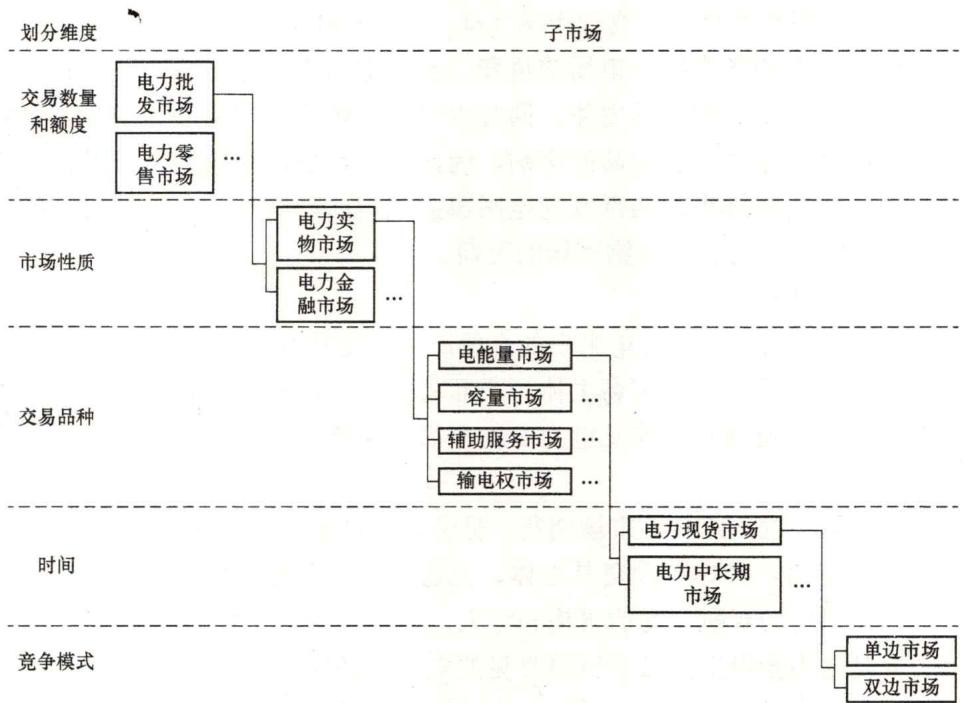

# 3. 电力市场有哪些划分维度？具体如何划分？

如前所述，电力市场体系实质是电力市场交易体系，包括市场主体、交易对象、交易类型、价格形成机制等方面。完备的电力市场通常由多个部分（子市场）共同构成，各子市场相互联系、相互制约，共同形成合力，推动整个能源电力经济的发展。

电力市场体系中各类市场的划分有不同的维度，一般有交易数量和额度、市场性质、交易品种、时间、竞争模式等维度，如图1-1所示。

图1-1 电力市场划分示意图

# （1）交易数量和额度。

电力市场总体上可以划分为电力批发市场和电力零售市场两大类。世界上多数地区的电力市场建设都是从建立竞争性电力批发市场起步的，仅有少数是从建立竞争性电力零售市场开始的，但终极目标都是逐步形成竞争性的批发和零售市场。

1）电力批发市场。发电企业与大用户之间开展大宗电力商品直接交易的行为一般称之为批发，对应的市场为电力批发市场，其交易电量和功率较大。电力批发市场的市场交易主体一般包括发电企业、供电公司、售电企业（代理不直接参与电力批发市场的电力用户）、电力大用户和电力交易商。发电企业卖电，供电公司、售电企业、电力大用户和电力交易商买电。

2）电力零售市场。供电公司、售电商面向终端用户的销售行为一般都称之为零售，其交易电量和功率相对较小。对应的电力零售市场界定为供电公司、售电商和中小用户（以及不愿意参与电力批发市场的大用户）之间进行电力交易的市场。供电公司、售电商通常通过电力批发市场由发电企业处购买电能，再通过电力零售市场向终端用户出售电力商品。

# （2）市场性质。

电力市场按其市场性质可分为实物市场与金融市场。一般而言，实物市场与金融市场可以通过按产品类型和市场主体的意图两个方面加以辨识。电力实物市场建设几乎是各国各地电力市场建设的重心，建设运营中普遍接受电力行政主管部门或监管机构的监管；电力金融市场严格意义上要接受金融监管机构的监管。

# 1）电力实物市场。

实物市场，业界也有译之为物理市场（physical market）的，它是以电能量及其相关服务产品交割为目的的各类细分市场的总和，包含电力生产、传输等环节相关的自然资源、基础设施、市场制度和市场主体，同时也包含实体商品的交易、交割及结算等。由于电力实物市场涉及电力实物商品的交割，因此实物市场的交割通常涉及实物商品的生产与输送环节，电力实物市场的范围受电网覆盖范围的严格制约。后续讨论的各类细分市场，若无特别说明，均属于实物市场的范畴。

# 2）电力金融市场。

电力金融市场涉及能源电力衍生出的金融产品的交易行为，具有金融衍生属性，包括市场结构与相关的制度安排、市场主体、产品与交易，同时也具备其特有的供求驱动因素。电力金融市场合同通常不涉及电力实物商品的交割，取而代之的是现金的交割（详见问题10）。

电力金融市场一般参照金融市场期货、期权交易的基本原理进行期货、电力期权等电力金融衍生品的交易，具体包含交易主体、交易标的以及交易规则三个方面的内容。交易主体可以为从事电力金融交易的机构和个人，只要符合章程规定，一般无地域的限制；交易标主要是电力金融衍生品，目前常见的电力金融衍生品合约主要有电力期货合约、电力期权合约等；交易规则主要包括了电力金融衍生品交易的结算规则、信息披露规则、风险控制规则、价格形成规则等。

电力金融市场是电力实物市场的完善与补充，能够吸引广泛的市场主体，增强电力市场的竞争性，增加市场的流动性，辅助发现电力市场真实的电力现货价格，为电力实物市场，尤其是现货交易提供所需的风险控制。

# （3）交易品种。

电力批发市场按其交易标的物的不同，一般可分为电能量市场、发电容量市场、电力辅助服务和输电权市场，各类市场相互联系、相互制约。

# 1）电能量市场。

电能量市场（也称能量市场）是电力市场中以有功功率电能量为交易标的物的市场，后文将予详述。

# 2）发电容量市场。

发电容量市场是指以可靠性装机容量为交易标的物的市场。容量市场的主要目的是保证系统总装机容量的充裕性，并为提供了可靠装机容量的机组给予必要的补偿。鉴于理想电力现货市场出清是基于边际成本定价的，在某些特定市场规则下，部分发电厂商单纯靠现货市场难以回收其全部投资和运营成本，需建立容量成本补偿机制，用于吸引电力投资，保障长期电力供应的充裕度。因此，发电容量市场实质上是对能量市场的有效补充，可在一定程度上帮助投资主体收回在能量和辅助服务市场不能完全回收的成本（详见问题8）。

# 3）电力辅助服务市场。

电力辅助服务指为维护电力系统的安全稳定运行、保证电能质量，除正常电能生产、输送、使用以外，由发电厂商、电网企业和电力用户等提供的服务。常见的电力辅助服务品种包括调频、备用、调压、黑启动等。相应地，电力辅助服务市场是指以调频、备用等各类辅助服务为交易标的物的市场，据此，电力辅助服务市场又进一步分为调频市场、备用市场、黑启动市场等。随着细分程度提高，辅助服务的品种还在不断创新。

电力辅助服务市场应当是伴随电力现货市场建设的一类特殊的辅助类市场。由于我国电力现货市场建设相对滞后，为解决提供辅助服务的公平问题，原国家电监会2006年底颁布了《并网发电厂辅助服务管理暂行办法》《发电厂并网运行管理规定》。我国六个区域分别结合本区域内电源、负荷和网络结构等实际情况，制定了相应的“两个细则”，之后陆续建设了各种辅助服务专项市场（如调峰市场、备用市场、调频市场），为我国电力辅助服务市场化做出了特别贡献。但本质上，“两个细则”确定的机制仅是一种辅助服务提供主体之间相互补偿的机制，而不是通常意义下提供者与使用者之间的市场机制。随着电力现货市场的建设发展，原来电能量与辅助服务一体的综合定价机制须相应解绑，对应的辅助服务补偿机制也应过渡为辅助服务市场机制。

为完成碳达峰和碳中和的历史使命，今后一个时期，风电、太阳能等新能源发电装机容量和比重势必快速增加，热电厂供热和发电、新能源消纳与电力可靠供应、新能源波动性与电力调节能力的矛盾日益突出，电力灵活性资源稀缺性日趋严重，电力辅助服务市场建设的紧迫性日渐凸显。

电力现货市场与电力辅助服务市场的运营主体具有天然的统一性，二者应当作为一个整体同步推进建设（详见问题7）。

# 4）输电权市场。

输电权市场是以网络的输电权为标的物进行交易的市场。输电权有物理输电权、金融输电权。物理输电权是指输电权持有者拥有在约定时段内，通过输电网络中约定的输电线路或断面输送一定功率电力的权利。金融输电权是一种在日前市场中让市场主体抵消输电阻塞成本的合同，严格意义上属于金融市场范畴。金融输电权可保障其持有者在特定的输电路径上抵消因输电阻塞而产生的成本。

# （4）时间维度。

电能量批发市场按其交易周期长短，通常可分为电力现货市场和电能量中长期市场（专指实物交易属性的电力中长期市场）。世界上多数地区的电力批发市场建设都是从建立电力现货市场或配套建设现货与中长期市场起步的。

关于按照电力交易的时间维度划分，中发9号文最初将电力交易类型分为中长期电力交易、短期和即时交易。之后，中发9号文配套文件中将短期和即时交易合并为现货交易，因此电力市场分为中长期市场和现货市场，与通常的分类相同。

# 1）电力现货市场。

电力现货市场可以定义为安排次日（或未来 $24\mathrm{h}$ ）发用电计划、为实现日内发用电计划滚动调整以及为保证电力供需实时平衡而组织的电力交易市场的总和。按照交易时间，现货市场一般可进一步分为日前市场和实时市场；此外，也有的分为日前市场、日内（小时前）市场、实时平衡市场（如北欧、英国电力市场），还有只将日前市场称为现货市场的。考虑到发电机组启停周期较长，有的国家和地区也会适当拉长现货市场交易周期。

目前在我国，根据《关于深化电力现货市场建设试点工作的意见》（发改办能源规〔2019〕828号）的界定，现货市场主要开展日前、日内、实时的电能量交易，通过竞争形成分时市场出清价格，并配套开展备用、调频等辅助服务交易。试点地区可结合所选择的电力市场模式，同步或分步建立日前市场、日内市场、实时市场/实时平衡市场。

# 2）电力中长期市场。

电力中长期市场可以理解为开展多日以上较长周期电能量交易的市场，考虑到电力供需波动的周期性和电能生产组织的时段性，电力中长期市场一般可组织多年、年、季、月、周等多日以上的电力交易。

根据《电力中长期交易基本规则》（发改能源规〔2020〕889号）的定义，电力中长期市场指“符合准入条件的发电厂商、电力用户、售电公司等市场主体，通过双边协商、集中交易等市场化方式，开展的多年、年、季、月、周、多日等电力批发交易”。并专门规定，“执行政府定价的优先发电电量和分配给燃煤（气）机组的基数电量（二者统称为计划电量）视为厂网间双边交易电量，签订厂网间购售电合同，相应合同纳入电力中长期交易合同管理范畴。”

# （5）竞争模式。

按照电力市场中参与者之间的竞争模式划分为单边市场和双边市场。

1）单边市场。单边市场指进行单向交易模式（通称强制电力库，如英国的pool模式）的电力市场。其主要特点为单边交易、强制进场。市场成员只能通过与电网调度机构（简

称调度机构）以单向交易的方式售卖电，即调度机构替用电方进行招标采购，代发电方投标售电，而不允许双方直接交易的市场。出现系统能量不平衡的问题后依赖集中调度的方式解决，所需费用由市场所有参与者平均分摊。而市场价格主要是基于发电方的报价竞争形成系统购入价，用电方需要支付的卖出价需增加部分辅助服务费、调度费等。

2）双边市场。双边市场指采用双边交易与平衡机制的市场。其主要特点为交易自由、责任自负。市场主体具有自由选择交易对象、交易场所、交易方式的权利。在交易中，发电方与用电方能够自主决定各项交易事项，因而双方需承担电量不平衡责任，由市场管理机构进行监督。除由调度机构单向购买的不平衡电量外，电力供需双方可以依据供需平衡共同决定交易价格。

