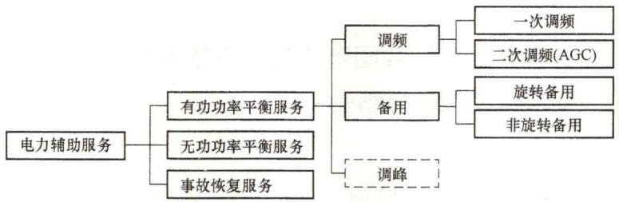
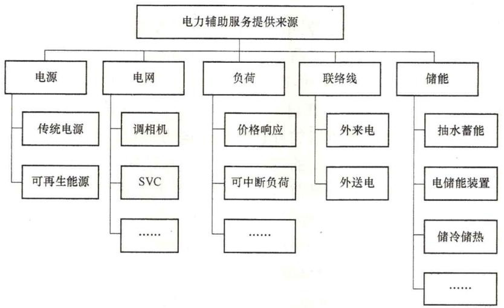

# 6. 什么是电力辅助服务？我国电力辅助服务分类和具体品种有哪些？提供电力辅助服务的来源有哪些？

# （1）电力辅助服务的定义。

根据我国原国家电监会颁布并实施的《并网发电厂辅助服务管理暂行办法》，电力辅助服务的定义为：为维护电力系统的安全稳定运行，保证电能质量，除正常电能生产、输送、使用外，由发电企业、电网经营企业和电力用户提供的服务。

美国联邦能源管理委员会（Federal Energy Regulatory Commission，FERC）将电力辅助服务定义为：考虑到控制区及其内部输电公共设施的义务，以维持互联输电系统的可靠运行，从而支持电力从卖方向买方传输的服务。

欧洲输电系统运营商联盟（European Network of Transmission System Operators for Electricity，ENTSO-E）将电力辅助服务定义为：由独立输电组织签约的，可以保证电力系统安全性的一系列功能。

可见，欧美对于电力辅助服务的规范定义较为宽泛，其中，美国主要从义务分担者的

角度进行定义，欧洲则主要从协议购买方的角度进行定义。我国对于辅助服务的规范定义则明确了辅助服务的作用、范围、提供主体和主要类型。其中，辅助服务的作用是维护电力系统的安全稳定运行，保证电能质量；范围是正常电能生产、输送、使用之外的服务；提供主体包括了发电企业、电网经营企业和电力用户。相对而言，我国对电力辅助服务的规范定义主要关注具体服务类型，沿用了运行管理的传统和习惯，更符合传统调度观念和运行管理规定。随着市场主体的丰富，电力辅助服务的定义须根据电力系统绿色低碳发展的需要进一步丰富服务品种，明确技术标准，将提供主体由现有的“源网荷”拓展至涵盖储能装置、可控负荷和虚拟电厂等新型辅助服务提供主体。

（2）我国电力辅助服务的分类。

我国电力辅助服务的种类十分丰富，可以从不同的角度进行分类。不同的电力系统由于电网结构、负荷特性等有所不同，所需要的辅助服务的种类与供应量也不同，对辅助服务的分类以及各品种辅助服务的定义也不尽相同，甚至在同一电力系统中，所需要的辅助服务也会随着电网结构、电源结构及负荷需求的变化而变化。

从功能的角度区分，电力辅助服务主要分为有功功率平衡服务、无功功率平衡服务、事故恢复服务三类，如图1-2所示。有功功率平衡服务主要包括调频、备用等，调频分为一次调频和二次调频。调峰作为一种特殊的有功功率平衡服务，产生于厂网分开、可再生能源大规模并网和电力现货市场尚未建立的背景，有效激励了灵活性发电资源的开发利用，但随着电力现货市场的建设和运行，将逐步与电能量日前、日内和实时（平衡）市场相融合。无功功率平衡服务主要为无功功率调节、电压支撑。事故恢复服务主要是指黑启动。

图1-2 电力辅助服务按功能分类

从按照“两个细则”规定是否补偿的角度区分，我国根据电力市场发展实际，将并网发电厂提供的辅助服务分为基本辅助服务和有偿辅助服务两大类，对基本辅助服务不进行经济补偿，对有偿辅助服务基于成本进行经济补偿。其中，基本辅助服务是指为了保障电力系统安全稳定运行，保证电能质量，发电机组必须提供的辅助服务，包括一次调频、基本调峰、基本无功功率调节等；有偿辅助服务是指并网发电厂在基本辅助服务之外所提供的辅助服务，包括自动发电控制、有偿调峰、旋转备用、有偿无功功率调节、黑启动服务等。

（3）电力辅助服务的品种。

电力辅助服务的品种十分丰富，按照原国家电监会颁布的《并网发电厂辅助服务管理

暂行办法》，辅助服务主要包括一次调频、自动发电控制、调峰、无功功率调节、旋转备用、黑启动服务等，具体定义如下。

1）一次调频是指当电力系统频率偏离目标频率时，发电机组通过调速系统的自动反应，调整有功功率减少频率偏差所提供的服务。

2）自动发电控制（AGC）是指发电机组在规定的出力调整范围内，跟踪电力调度指令，按照一定调节速率实时调整发电出力，以满足电力系统频率和联络线功率控制要求的服务。自动发电控制的作用为解决快速负荷波动与较小程度发电变化问题，使系统频率稳定在正常值或接近正常值的水平。

3）调峰是指发电机组为了跟踪负荷的峰谷变化而有计划的、按照一定调节速度进行的发电机组出力调整所提供的服务。调峰根据出力调整范围分为基本调峰和有偿调峰。

4）无功功率调节是指发电机组向电力系统注入或吸收无功功率所提供的服务，根据功率因数范围可分为基本无功功率调节和有偿无功功率调节。

5）旋转备用是指为了保证可靠供电，调度机构指定的并网机组通过预留发电容量所提供的服务。旋转备用必须在 $10\mathrm{min}$ 内能够调用。旋转备用的作用为消除可能危害系统稳定的、难以预测的大电能偏差。

6）黑启动是指电力系统大面积停电后，在无外界电源支持情况下，由具备自启动能力的发电机组所提供的恢复系统供电的服务。黑启动的作用为保证系统在任何情况下都可以快速恢复运行。

除了原国家电监会颁布的《并网发电厂辅助服务管理暂行办法》中所定义的8个辅助服务品种外，各区域在制定、修订“两个细则”过程中均结合本区域电力系统运行的实际情况定义了一些辅助服务品种，具体定义如下。

1）自动电压控制（AVC）是指在自动装置的作用下，发电厂的无功功率、变电站和用户的无功功率补偿设备以及变压器的分接头根据电力调度指令进行自动闭环调整，使全网达到最优的无功功率和电压控制的过程。自动电压控制的作用为将各母线上的电压控制在接近正常值的很小范围内。目前，《华北区域并网发电厂辅助服务管理实施细则》（2019版）、《华东区域并网发电厂辅助服务管理实施细则》（2019版）、《西北区域并网发电厂辅助服务管理实施细则》（2019版）、《华中区域并网发电厂辅助服务管理实施细则》（2020版）、《南方区域并网发电厂辅助服务管理实施细则》（2020版）、《东北区域并网发电厂辅助服务管理实施细则》（2020版）中设置了该品种，但具体定义有所差别。

2）低频调节是指当出现跨区直流功率失却等原因造成电网频率低于规定值[例如《华东区域并网发电厂辅助服务管理实施细则》（2019版）规定 $49.933\mathrm{Hz}$ 时，发电机组参与所在控制区频率或者联络线偏差控制调节，短时快速增加发电出力，以满足电力系统频率要求的服务。目前，华东区域设置了该品种。

3）热备用是指为了保证可靠供电，根据电力调度指令指定的未并网机组所提供的必须在规定的时间（如《华东区域并网发电厂辅助服务管理实施细则》规定1h）内能够调用的备用容量。

4）快速甩负荷是指电网发生严重事故时，发电机组根据电力调度指令与电网解列，转为只带厂用电的孤岛运行方式，并在电网事故消除后迅速并网，恢复向外供电所提供

的服务。目前，华东区域设置了该品种。

5）调停备用是指燃煤发电机组按电力调度指令要求超过规定的时间（如《西北区域并网发电厂辅助服务管理实施细则》规定72h）内的调停备用。目前，西北区域设置了该品种。

6）冷备用是指并网火力发电机组、核电机组由于电网运行安排、可再生能源消纳等需要，按电力调度指令停运，到接到电力调度指令再次启动前的备用状态，备用时间需大于规定时间（如《南方区域并网发电厂辅助服务管理实施细则》规定72h），由于电厂自身原因停机不作为备用时间统计，但经检修后报备用开始算作冷备用时间。目前，南方区域设置了该品种。

7）稳控装置切机服务是指因系统原因在发电厂设置的稳控装置正确动作切机后应予以补偿。目前，西北区域设置了该品种。

实践中大多数电力辅助服务市场中的辅助服务交易品种主要有负荷跟踪与频率控制（AGC）、备用、无功功率电压支持、事故恢复服务（黑启动）。

（4）提供电力辅助服务的来源。

电力辅助服务对电力系统运行和电力市场运营都起着不可或缺的作用，所涉及提供来源主要包括源、网两方面。随着技术的进步和市场改革的深入，储能技术和需求侧资源等进一步丰富了电力辅助服务提供来源的范围，电力辅助服务提供来源如图1-3所示。

图1-3 电力辅助服务提供来源

传统上，辅助服务的提供来源主要为水电机组、火电机组和电网设备，在核电占比较高的国家和地区，核电机组也是辅助服务的提供来源。近年来，储能装置、需求响应等新兴资源呈多元化趋势。

储能装置包含抽水蓄能、电化学储能、飞轮储能、压缩空气储能等多种形式，通过控制电能与化学能、动能、势能等能量形式的转化，实现电能的吸纳和释放。由于部分电储能装置充放电过程相对于传统机组更为快速，控制也更为精确，已应用于改善电网调频效果、平滑间歇性能源出力、负荷跟踪等方面。

需求响应一方面结合电储能装置，另一方面由负荷集成商对成规模的可控负荷集中控制，通过施加一定的控制策略，在满足日常生产生活需求的同时，发挥整体调节潜力。

随着技术进步，可再生能源不仅作为电能量的生产者、辅助服务的使用者，也可以通过调节发电出力在必要时提供辅助服务，电储能装置的引入，使其可控性得以大幅改善。

在以上几种新兴资源的基础上，可进一步采用“虚拟电厂”将分布式发电机组、可控负荷和分布式储能设施有机结合，辅以配套的调控技术、通信技术成为对各类分布式能源进行整合调控的载体，作为一个特殊电厂参与电力辅助服务市场和电网运行。

此外，远端电源也可以利用科学的调控手段参与提供辅助服务，在必要时为系统安全运行提供支持。

电网侧的SVC、调相机等装置，可以发挥辅助服务资源的作用，但由于其作为电网侧调控装置的特殊定位，并不适于与上述其他辅助服务资源共同参与市场竞争。

