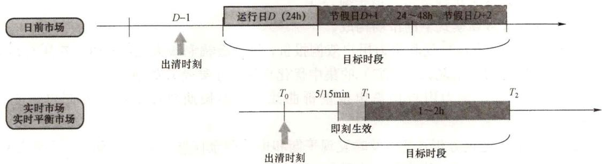

# 13. 电力现货市场按时间尺度具体又可划分为哪些子市场？

电力现货市场一般是指为次日（或未来 $24\mathrm{h}$ ）电能交易以及为保证电力供需的即时平衡而组织的实时电力交易。按照交易时间，现货市场一般可进一步分为日前市场、日内市场、实时市场/实时平衡市场。日前市场主要开展次日的电能交易，确定次日（一般是96或者48时段）的现货交易量和价格。日内市场是指在日前市场闭市后至实时市场开启前的某（些）时段的电能量市场，通常每个交易时段为 $15\sim 60\mathrm{min}$ 。实时市场/实时平衡市场是指在实时调度1h内开展的交易。一般根据市场模式不同，选择不同的现货市场组成，且在不同市场模式下，各周期的市场功能也有所不同。

现货市场时间轴如图1-4所示，集中式市场模式下，现货市场构成一般选择日前市场、实时市场。分散式市场模式下，现货市场构成一般选择日前市场、（日内市场）、实时平衡市场。以国外为例，可归类为集中式市场模式的国家和地区中，美国PJM、MISO、

加州（CASIO）、得克萨斯州（ERCOT）等选取的是日前市场和实时市场，澳大利亚、新加坡选取的是实时市场，其中，澳大利亚在日前采用预出清进行市场预测；可归类为分散式市场模式的国家和地区中，北欧和英国选取的是日前市场、日内市场、实时平衡市场等。需要说明的是，不同国家和地区，各周期现货市场的具体做法稍有所不同。总结两种模式下不同周期现货市场的功能及特点，具体如下。

图1-4 现货市场时间轴

（1）集中式市场模式下的市场构成。

市场供需双方在每天特定时间之前向调度机构报价，由调度机构根据供需双方报价和网络条件等出清。在不同国家，日前市场的名称有所不同。例如，在挪威和美国PJM电力市场称日前（day-ahead）交易，在澳大利亚称短期提前（short-run ahead）交易，在我国也有专家称之为预调度计划（pre-dispatch schedule）。日前市场每天出清一次，具有如下特点：

1）市场参与方根据各自成本和预期进行报价，报价内容包括发电机组参数（如电气连接点/市场结算点和发电容量）、同容量所对应的供给价格，如果用户侧参与报价，则需提供负荷的市场结算点、需求电量及价格。

2）基于所有报价信息，调度机构在安全校核的基础上决定最优化的机组组合方案，并基于最终的机组组合方案和修正后的机组报价，决定最终的机组、负荷的出清量和相应的日前价格。

3）市场采用节点边际电价确定市场价格，也有采用区域边际电价或者系统边际电价方式。调度机构在考虑系统安全约束的前提下，根据市场参与方成员的报价做电能平衡计算，形成考虑安全约束的日前市场调度模型，通过求解安全约束经济调度（security constrained economic dispatch，SCED）计算系统次日每个时段的调度计划和电价。

4）有的市场会规定最高限价，卖方报价不得超过规定限价，如PJM。有的市场会进行一个以机组成本参考价为基准的行为和价格影响测试，对违反测试的机组视为利用市场力，会强制使用成本参考价代替原机组报价参加下一阶段的优化出清，如NYISO。

日内市场主要解决快速启停机组的开机决策问题，也有专家认为日内市场解决可再生能源不能准确预测的问题。日内交易电量较少，但对交易操作的时效性要求较高，对参与者和运营者都有一定的技术要求。

实时市场主要根据超短期负荷预测进行发电调度，对各种备用和必开机组预先进行资源分配和实时阻塞管理，通过市场竞争交易实现系统平衡调度，发电上网电量必须在实时市场报价和中标。调度机构根据机组在日前市场提供的报价曲线或实时修改的报价曲线和超短期负荷预测，基于安全约束经济调度模型，实时计算各机组下一个时间段的中标电力及市场出清价格。一般实时市场每 $5\mathrm{min}$ 或 $15\mathrm{min}$ 出清一次，以电网实时运行状态下的最优经济调度来实现电力供需平衡。

（2）分散式市场模式下的市场构成。

日前市场中，发电厂商和电力用户双侧报价，以社会福利最大化为目标，对所有市场主体开展基于可用输电能力（ATC）的集中优化出清。主要特点如下：

1）发电厂商、电力用户均需申报量价曲线，以中长期双边交易之外的电量竞价上网。

2）调度机构通过分析计算，及时发现平衡和电网安全问题，引导市场成员调整交易，并非以调度指令的方式安排生产，也不进行机组组合。

3）日前市场的出清结果需要进行实物交割。

4）价格形成机制包括系统边际电价、分区边际电价。

日内市场更多的作用是日前市场的延伸，通过日内连续交易为各市场主体，特别是可再生能源占比较大的主体调整自身发用电计划提供机会，以实现自平衡责任。一般是在日前市场闭市后，对未来至实时调度前1h的市场供需变化进行的电力交易。市场参与方的报价规则和市场交易规则一般与日前市场相同。

实时平衡市场是指在实时调度1h内，调度机构根据系统电力平衡的需要，进行电力交易，市场成员既可以报卖出量价，也可以报买入量价。调度机构采用偏差平衡，依托平衡资源，以调整成本最小为目标，接受市场主体上调或下调报价，保障电力实时供需平衡（详见问题14）。

我国在未建设电力现货市场前，为确保电力系统安全、优质、经济运行，调度机构依据有关规定对电力系统生产运行、电网调度系统进行计划、组织，指挥、协调及控制。我国电网调度管理依照《电网调度管理条例》和《电网调度管理条例实施办法》进行，办法中规定，“调度机构应当按年、月、日编制并下达发电调度计划”，“值班调度员根据电网运行情况，可以按照有关规定调整本调度机构下达的日发电、供电调度计划”。电力现货市场启动建设后，市场建设以实现电网安全、稳定、经济运行为目标，参照我国电网调度生产运行传统模式，电力现货市场按时间尺度一般选取日前市场、（日内市场）实时市场/实时平衡市场。试点地区可结合所选择的电力市场模式，同步或分步建立日前市场、日内市场、实时市场/实时平衡市场。

