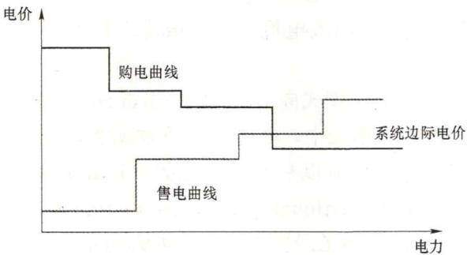
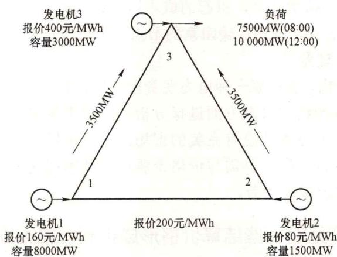
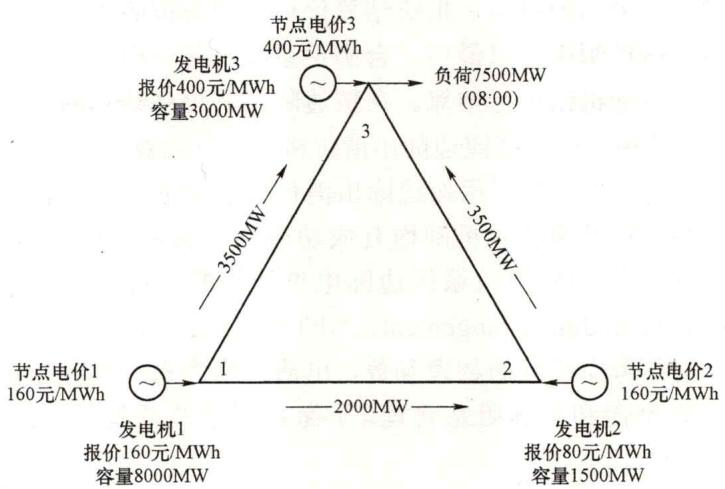

# 17. 电力现货市场有哪些出清价格形成机制？影响电力现货市场出清价格的因素有哪些？

（1）电力现货市场的出清价格形成机制。

电力现货市场出清价格是根据供需报价和系统网络约束等算法，计算得到每个时刻、某一节点（区域或系统）的电能量成交价格。电力现货市场出清价格形成机制影响市场主体的报价行为、运行效率和市场力，是电力市场顶层设计的重点任务。目前国内外的主要电力现货出清价格形成机制采用边际出清价格机制，主要包括系统边际电价、分区边际电价和节点边际电价等具体价格形成机制。

1）系统边际电价。系统边际电价是指在现货电能交易中，按照报价从低到高的顺序逐一成交电力，使成交的电力满足负荷需求的最后一个电能供应者（称之为边际机组）的报价，如图1-5所示。系统边际电价是反映电力市场中电力商品短期供求关系的重要指标之一，是联系市场各方成员的经济纽带。系统边际电价模式适用于电网阻塞较少、阻塞程度较轻、阻塞成本低的地区。

2）分区边际电价。实际运行中，电网不同区域之间可能发生输电阻塞，而在区域内部输电阻塞发生的概率较小或情况比较轻微。此时，可采用分区边际电价，按阻塞断面将市场分成几个不同的区域（即价区），区域内的所有机组用同一个价格，即分区边际电价。分区边际电价模式适用于阻塞频繁发生在部分输电断面的地区。如北欧电力市场就是采用分区电价体系。

图1-5 系统边际电价形成示意图

3）节点边际电价。节点边际电价模式适用于电网阻塞程度较为严重、输电能力经常受限的地区。节点边际电价也称为节点电价，LMP 计算特定的节点上新增单位负荷（一般为 1MW）所产生的新增发电边际成本、输电阻塞成本和损耗。LMP 提供了一个开放、透明、非歧视的机制来处理在电网开放条件下的电网阻塞问题，可以将因阻塞导致的成本信息反映给市场成员，LMP 的计算是有安全约束的经济调度的优化结果。LMP 在美国电力市场中得到普遍采用，如 PJM 电力市场。

电力现货市场出清价格机制选择系统边际电价、分区边际电价或节点边际电价，主要考虑电网阻塞情况，在分区内部不存在阻塞的情况下，分区内各节点边际电价等于分区边际电价，在分区间不存在阻塞的情况下，分区边际电价等于系统边际电价。如果将整个电网简化为一个节点，这个节点的节点边际电价就是系统边际电价，如果将整个电网按分区简化为几个节点，每个节点的节点电价就是分区边际电价。

从国内外电力现货市场建设经验来看，系统边际电价、分区边际电价和节点边际电价机制均有成功的应用，不同市场价格机制的优缺点和典型市场应用如表1-1所示。

表1-1

不同市场出清价格机制优缺点

<table><tr><td>价格机制</td><td>优点</td><td>缺点</td><td>典型市场</td></tr><tr><td>系统边际电价</td><td>价格波动较小,有利于市场平稳起步</td><td>会对阻塞区的机组不公平,低价强卖,高峰低谷价差不大,不能引导低谷用电</td><td>北欧市场(平衡机制)</td></tr><tr><td>分区边际电价</td><td>价格波动性适中,市场主体相对容易接受,也能够防止个别节点高价</td><td>分区的规则和算法难以保证公平性,少数节点的阻塞可能会影响很多节点的市场成员价格,影响范围很大</td><td>北欧市场(日前)、澳大利亚</td></tr><tr><td>节点边际电价</td><td>价格能够体现资源稀缺性,最符合经济学原理,国外可借鉴的经验也较多</td><td>峰谷价差可能很大,市场成员接受难度大,特别是居民用电短时间没法传到价格信号,出现平衡账户资金问题</td><td>美国PJM、MISO</td></tr></table>

# （2）影响电力现货市场的出清价格的因素。

影响电力现货市场电能量出清价格的因素可从发电侧、输配电和用户侧三个方面考虑，具体因素有：

1）发电厂商电量成本。发电厂商的成本可分为容量成本和电量成本。其中容量成本包括发电厂的投资、运行和人工等固定成本，与发电量无关；电量成本则包括燃料、机组维护等成本，取决于发电量的大小。发电厂商每增加单位发电量所增加的成本为发电的边际成本。从经济学角度讲，为了保证收益，发电厂商报价应高于其边际成本，才能保证每千瓦时电的利润为正。因此，在不考虑发电成本补贴等机制时，边际成本越高，申报价格越高，在系统负荷相同的情况下，为满足系统负荷需求，调用的边际机组的价格也高，相应地，市场出清价格（系统边际电价、分区边际电价或节点边际电价）也较高。

2）发电厂商市场力。在现货市场环境下，若发电厂商具有影响甚至操纵市场价格的能力，则称该发电厂商具有市场力。市场力会引导发电厂商通过进行策略性投标而不是降低自身成本来增加利润。该在现货市场初级阶段，一些发电厂商会利用市场规则的不

完善性，通过对自身及其他企业的市场力、市场信息进行分析，进而提出偏离其边际成本的报价，这将会给出清电价带来严重的不确定性波动。

3）输电阻塞。在理想的电力市场中，系统中任意节点的发电厂商均可自由地向任意节点的负荷供电，保证市场的最大自由度。然而，输电系统由于自身网络容量限制所造成的输电阻塞极大地限制了这种自由度。在实际的电力市场运营中，由于发、用市场规模的不断扩大，阻塞的可能性不断增加。线路检修、线路扩容、断面传输容量约束均会改变线路的阻塞情况。通常而言，发电厂商意识到自己所处位置的网络情况后，会通过报价来操纵节点电价，一般负荷口袋区的发电厂商报价较高，而在负荷外送区的企业报价较低；但由于网络阻塞的原因，外送区报低价的发电厂商无法将电力送进区域内部，只能调用负荷口袋区的高价机组，导致该时段负荷口袋区的节点电价上升。由于线路阻塞情况的不同，在其他因素不变时，调用的高价机组电量不同，导致节点电价的差异。

4）市场供需比。电价通常由电力商品的供给曲线和需求曲线共同决定。随着工业的快速发展和人民生活水平的提高，社会对电力的需求也不断增长；同时，电力消耗的随机性和不连续性，造成电力需求具有很强的波动性。不同季节、不同时段的电力需求差异较大。通常发电厂商的供给曲线与发电成本紧密相关，短期内发电成本不会有太大的变动，其正常供给曲线也不会有太大的变化，但发电厂商可以通过物理持留来操纵价格，在高峰时段负荷较大时，发电厂商通过不报满容量改变供需比，同时配合高价申报即可造成人为阻塞和节点电价攀升。因此，需要从系统负荷不变时改变机组申报容量和机组申报容量不变时改变系统负荷两个方面来分析市场供需比对市场出清电价的影响。

5）其他因素。现货市场环境下，机组约束信息（包括爬坡约束、出力上下限约束、指定状态约束等）会影响各时段出清价格，同时系统备用容量（包括正、负备用容量需求）也会对节点电价产生影响。

因为现货市场的系统边际电价、分区边际电价和节点边际电价形成机制和影响因素类似，节点边际电价的形成机制最为复杂，理解节点边际电价形成和影响因素也可类似理解分区边际电价和系统边际电价的形成和影响因素。

下面以一个简单的三节点输电网络例子来说明节点电价的形成及影响价格的因素。具体参数如图1-6所示。节点3为负荷节点，上午08:00负荷需求为7500MW，12:00负荷需求为10000MW。为便于计算，假设连接3个节点的3条输电线路容量限制均为8000MW。

上午08:00负荷为7500MW，SCUC出清按报价由低到出清原则，发电机组2出力1500MW，发电机组1出力6000MW，发电机组3无需开机，并且3个节点间不存在阻塞，因此系统电能价格由发电机组1的报价决定，即160元/kWh，此时各节点电价均为160元/MWh。中午12:00负荷上升至10000MW，此时发电机组1出力8000MW，发电机组2出力1500MW，发电机组3出力500MW，系统电能价格由发电机组3决定，上升至400元/MWh，3个节点的节点电价均为400元/MWh；可见，负荷的变化可影响市场电能量价格。

图1-6 三节点输电网络

线路传输容量约束网络如图1-7所示。如果发电机组3的发电厂商将报价提高至800元/MWh，中午12:00的系统电能价格将上升至800元/MWh，可见发电厂商报价行为对市场价格也有一定的影响，特别是具有较大市场力的发电厂商或发电厂商串谋可以明显地影响市场价格，因此现货市场需要建立市场力监测及缓解机制，对发电厂商超过合理成本和利润报价并影响市场出清价格的行为进行监测和处置，保障市场平稳、安全和稳定运行。

如果节点之间存在传输容量约束，假设连接3个节点的3条输电线路容量限制均为3500MW。

图1-7 线路传输容量约束网络

上午08:00发电机组1发电出力只能5500MW，发电机组2出力为1500MW，发电机组3为500MW，满足负荷需求，此时，系统电能价格由发电机组决定，为200元/MWh，可见线路传输容量对市场出清价格有影响。此时，节点1、节点2因增加负荷而引起的成

本价格为160元/MWh（可由发电机组1增加出力），节点1和节点2的节点电价为160元/MWh；而节点3的负荷增加时，引起的成本增加为400元/MWh，因此节点3的节点电价为400元/MWh。因此，发送传输阻塞的节点，节点电价不在一致，这也充分反映了节点边际电价本身的物理意义。

从以上分析可以看出，选择哪一种电力现货市场出清价格形成机制，需要从电力市场供给、需求、网络、电源结构等多方面进行分析，根据市场实际情况综合考虑设计市场出清价格机制。但世界上原本就没有完美的市场，电力市场建设唯有不忘初心，围绕价格形成机制这一核心建设，解决供需与价格矛盾这一基本问题，才能最终实现资源的优化配置与行业健康发展的根本使命。

