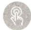

# 23. 电力辅助服务市场如何定价？辅助服务费用如何分摊？国外辅助服务费用分摊有哪些值得借鉴？

电力市场辅助服务定价是指对保证电能安全、优质输送而提供的额外服务的定价，不论采用何种方法获取辅助服务，均存在费用分摊的问题。从原理上讲，应按每个用户使用的各种服务的份额来确定，但这在理论上是一个非常困难的问题，由于各国电力市场模式的差异性，各电力市场辅助服务费用的分摊机制不同。欧洲、美国等地区的电力辅助服务市场建设起步相对较早，已经形成了较为成熟的经验，对我国电力辅助服务市场费用分摊具有一定的启示意义。

（1）辅助服务产品的定价方式。

当前国内外辅助服务产品的定价方式有不付费、基于成本的补偿制、价值核算制、双边合约、市场化竞标和实时竞价6种。

1）不付费。系统强制性要求供给方提供辅助服务并且没有额外的付费。这种机制广泛地用于垂直一体化的电力工业中或实行全电价的系统中。从表面上看，这种机制可以降低终端用户承担的辅助服务费用，但它实际上包含在终端电价中。

2）基于成本的补偿制。这种机制随着电力工业的放松管制得到了广泛的应用。在实施过程中遇到的主要问题是如何合理地确定计算辅助服务成本的方法。另外，也需要必要的惩罚和奖励措施，以保证系统能够得到可靠的辅助服务资源。

3）价值核算制。这种机制首先估算购买方由于获得了辅助服务而创造的价值，然后以此为基础定价。目前还没有真正的应用实例。在大多数情况下估价可能明显超过成本，因此能够使系统得到稳定的和充足的服务，但会增加终端用户的费用。

4）双边合约。由双方协商形成辅助服务的价格。这种机制的不足之处是由于双边合约具有内在封闭性，合同细节通常是保密的，合同之外的第三方不能够得到辅助服务的价格和其他信息，因此无法据此提供更优质、廉价的服务。

5）市场化竞标。在这种机制下，供给方按一定的技术要求进行投标，购买方按照服务水平和投标价格在供给方之间进行选择，供需双方通常签订 $2\sim 5$ 年的中长期合同，在合同有效期内价格是固定的，因此这种机制特别适用于可能出现短期区域性垄断的服务，如无功调节和黑启动服务。

6）实时竞价。价格通常是由市场竞争或交易协议短期提前确定的。实时竞价机制已经广泛应用于电能量交易市场中。这种机制最大的缺点是操作复杂、运作的交易成本很大。综上所述，没有一种单一的定价机制能够适用于所有的辅助服务品种，每一种辅助服务都需要有适合自身的定价机制。一般情况下，以市场为导向的方法可以更好地达到

前面提出的定价机制的目标，但这时要有足够的资源参与竞争才能够形成正常的市场环境，同时也要有完善的规则来保证市场的正常运作。

（2）辅助服务费用的分摊方式。

由于电力市场模式的差异性，各电力市场对于辅助服务费用的分摊机制也不同，总体来说可分为发电企业承担、终端用户承担、共同承担和引发负责4种方式。

1）发电企业承担。在发电企业之间进行分摊，并不将辅助服务费用直接分摊到用户侧。从表面上来看，这种机制没有将辅助服务费用传递到终端用户，实际上，发电企业在进行电能报价时已经考虑了其提供辅助服务的成本，辅助服务费用是隐性地传递到了用户侧，阿根廷电力市场采用这种方式。

2）终端用户承担。目前国外大多数国家都采用这种分摊机制，主要的分摊方式包括输电费用和系统调度专项费用。美国PJM市场将调频、备用辅助服务义务按照比例分配给负荷服务商（LSE）。LSE可以通过自行提供或通过与第三方签订合同来履行自己的调频、备用义务。若仍然无法完全履行其义务，可以从PJM辅助服务市场上购买调频、备用服务。

3）共同承担。目前，在澳大利亚电力市场中，调频费用由发电企业和电力用户按照一定比例来分摊。

4）引发负责。电力系统频率变化是发电机组输出的有功功率与负荷消耗的有功功率之间不平衡所致。发电机组输出的有功功率与用电负荷消耗的有功功率偏离越大，频率波动幅度会越大。当频率波动产生的互联电网区域控制偏差（ACE）超过一定阈值时，即需调用调频服务。为体现调频辅助服务成本分摊的公平性和合理性，可按偏差责任分摊调频成本，进而能够约束市场主体的行为，提高系统运行的稳定性与经济性。

（3）国外辅助服务费用分摊示例。

国外辅助服务费用的分摊方式也各不相同：

1）英国电力市场。辅助服务费用由英国国家电网公司下辖的调度机构通过系统平衡服务费（BSUoS）、基于发用电双方在电网接入点的上网或下网电量按固定比率来分摊。

2）美国PJM电力市场。辅助服务费用由市场中的负荷服务商（LSE）或大用户基于他们的相对负荷量来分摊。

3）北欧电力市场。各国一般均遵循“谁收益，谁承担”的原则，将辅助服务费用纳入过网费或平衡服务费中，最终由用户侧进行承担。

4）澳大利亚电力市场。辅助服务费用由能源市场运营机构（AEMO）基于发用电量比例向发电方或用电方分摊。

