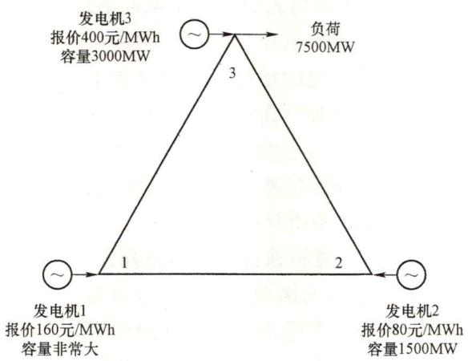
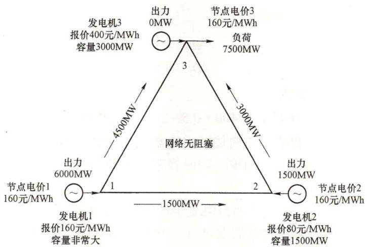
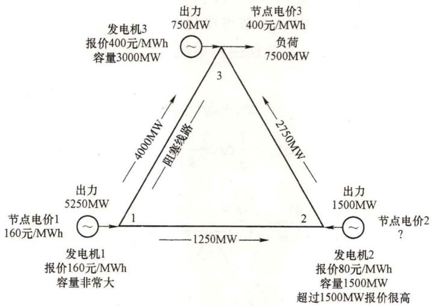
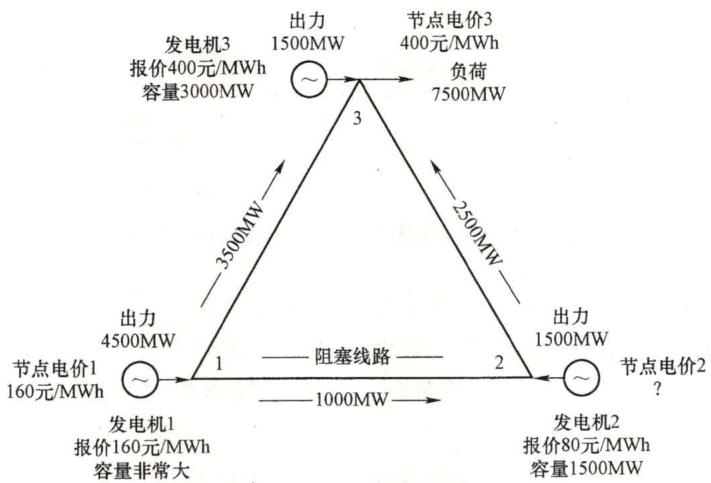
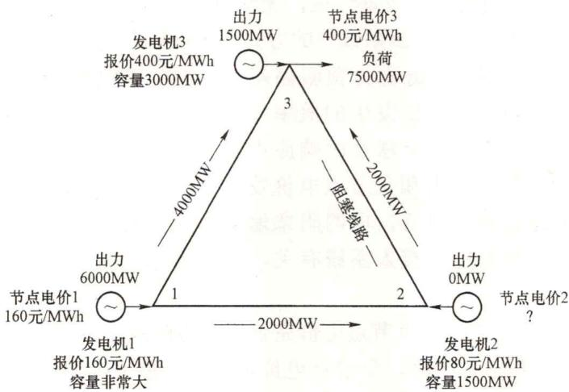
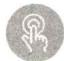

# 28. 现货市场中负节点电价产生的原因是什么？

当输电网络出现阻塞时，各个节点供应一个电力负荷增量的最小成本不同，也就是在各个节点的电能价值不同。由于输电网络阻塞，在一个给定节点的电力负荷增量无法完全由发电成本最低节点的可用发电容量来供应，而是需要调节各个节点的发电注入，由此导致的系统总供给成本增加量也就是节点电价出现无法直观理解的现象，某些情况下甚至会出现节点价格为负数的情况。

要理解节点电价可能出现的各种情况，需要对节点电价的计算方法进行阐述。以问题17中的三节点输电网络为例，具体参数如图1-8所示。

图1-8 三节点输电网络

场景一：无网络阻塞。在这种情况下，在现货电能交易中为满足节点3的7500MW负荷需求，首先由价格最低的发电机2承担1500MW，剩余6000MW由价格次低的发电机1承担。为确定3个节点的节点电价，在3个节点上分别新增1MW负荷。由于无网络阻塞，易知当节点1、2、3分别新增1MW负荷时，均可由发电机1功率增加1MW来满足。因此3个节点的节点电价均为发电机1的报价，即160元/MWh。此时的输电网络电力潮流如图1-9所示。

场景二：考虑到输电线路1-3的网络安全约束。假设线路1-3输电极限为4000MW，那么在现货电能交易中，价格最低的发电机2出力1500MW，价格次低的发电机1的出力受到网络断面的限制，出力为5250MW，节点3的未满足负荷750MW由本地发电机3承担。此时的输电网络电力潮流如图1-10所示。

图1-9 无网络阻塞下三节点输电网络电力潮流

图1-10 线路1-3阻塞下三节点输电网络电力潮流

节点1新增1MW负荷，由于节点2发电机2已没有剩余发电能力，只能由发电机1承担，因此节点电价为160元/MWh；节点3新增1MW负荷，由于节点1发电机1受网络约束限制，无法满足节点3的新增负荷，只能由发电机3承担，因此节点电价为400元/MWh。

节点1和节点3的新增发电成本均由所在节点的机组边际成本来决定，但受电力潮流的物理特性限制，这对节点2并不适用。节点2新增1MW负荷，不能直观得到由哪台机组承担，需要通过计算得到。

不失普遍性，设发电机1新增出力 $\Delta p_{1}$ ，发电机3新增出力 $\Delta p_{3}$ ，同时不能使得线路1-3潮流越限，因此有：

$$
\Delta p _ {1} + \Delta p _ {3} = 1
$$

$$
\Delta f _ {1 3} = \frac {1}{3} \Delta p _ {1} - \frac {1}{3} \Delta p _ {3} = 0
$$

解得：

$$
\Delta p _ {1} = 0. 5
$$

$$
\Delta p _ {3} = 0. 5
$$

因此节点2的节点电价为：

$$
1 6 0 \times 0. 5 + 4 0 0 \times 0. 5 = 2 8 0 (\text {元} / \mathrm {M W h})
$$

这个价格是由节点1和节点3的边际发电机组的净注入变化量的成本共同决定的，这个出力组合变化量的总和为1MW，同时在阻塞输电线路1-3上产生的净电力潮流为0。

场景三：考虑到输电线路1-2的网络安全约束。假设线路1-2输电极限为 $1000\mathrm{MW}$ 那么在现货电能交易中，价格最低的发电机2出力 $1500\mathrm{MW}$ ，价格次低的发电机1的出力受到网络断面的限制，出力为 $4500\mathrm{MW}$ ，节点3的未满足负荷 $1500\mathrm{MW}$ 由本地发电机3承担。此时的输电网络电力潮流如图1-11所示。

与场景一类似，节点1和节点3的节点电价分别为160元/MWh和400元/MWh。对于节点2，假设其新增的1MW负荷分别由发电机1和发电机3承担，同时不能使得线路1-2潮流越限，因此有：

$$
\Delta p _ {1} + \Delta p _ {3} = 1
$$

$$
\Delta f _ {1 2} = \frac {2}{3} \Delta p _ {1} + \frac {1}{3} \Delta p _ {3} = 0
$$

图1-11 线路1-2阻塞下三节点输电网络电力潮流

解得：

$$
\Delta p _ {1} = - 1
$$

$$
\Delta p _ {3} = 2
$$

因此节点2的节点电价为：

$$
1 6 0 \times (- 1) + 4 0 0 \times 2 = 6 4 0 (\text {元} / \mathrm {M W h})
$$

节点2的电价高于节点1和节点3的机组边际成本，这是因为节点2的负荷增加会加

重输电线路阻塞。为满足电网网络安全约束，必须在另外2个节点上通过增减发电出力的方式来满足节点2上的新增电力负荷，使其对阻塞线路的潮流影响互相抵消。

场景四：考虑到输电线路2-3的网络安全约束。假设线路2-3输电极限为 $2000\mathrm{MW}$ 那么在现货电能交易中，调用价格最低的发电机2不再是最优方案，这是因为当由发电机1和发电机2来供应节点2的电力负荷时，输电线路2-3很快就会出现阻塞，使得节点3的大部分电力负荷只能由成本最高的发电机3来供应，使得系统总供电成本较高。最经济的方案是发电机1出力6000MW，发电机3出力1500MW。此时的输电网络电力潮流如图1-12所示。

图1-12 线路2-3阻塞下三节点输电网络电力潮流

与场景一类似，节点1和节点3的节点电价分别为160元/MWh和400元/MWh。对于节点2，假设其新增的1MW负荷分别由发电机1和发电机3承担，同时不能使得线路2-3潮流越限，因此有：

$$
\Delta p _ {1} + \Delta p _ {3} = 1
$$

$$
\Delta f _ {1 2} = \frac {1}{3} \Delta p _ {1} + \frac {2}{3} \Delta p _ {3} = 0
$$

解得：

$$
\Delta p _ {1} = 2
$$

$$
\Delta p _ {3} = - 1
$$

因此节点2的节点电价为：

$$
1 6 0 \times 2 + 4 0 0 \times (- 1) = - 8 0 (\text {元} / \mathrm {M W h})
$$

节点2新增电力负荷需要其他2个节点协调增减发电出力来满足，其中发电机1增加出力导致的成本增加量，小于发电机3减少出力导致的成本降低量，使得系统总供电成本降低，因此节点2的价格为负值。

由以上算例可知，在某一节点新增单位负荷，导致的系统总供电成本变化量可正可负。当系统总供电成本降低时，该节点的节点电价便为负值。

以上从节点电价的数学原理角度阐述了负节点电价产生的原因。在电力现货市场实际运营中，出现负节点电价表明市场中供大于求或电网局部存在严重阻塞，意味着发电机组为保持运转不得不向用户支付费用以鼓励用电。

从供需形势看，受可再生能源渗透率不断提升、整体用电需求增速放缓等因素影响，电力总体供大于求、市场竞争激烈，价格下行趋势明显。

从竞价策略看，出于发挥低边际成本优势、获取补贴或规避高额启停成本等考虑，部分机组在市场中采取报零价或负价竞争策略。对于新能源机组，边际发电成本接近于零，特别是并网较早、有补贴收入的项目，在市场中可能会采取报负价的方式提高上网电量。对于常规火电机组，受到技术和成本约束，无法频繁启停且有最小出力限制，在供大于求且竞争激烈时，不得已采用“倒贴钱”的方式获得继续发电的权利。

从系统运行看，受到新能源出力预测偏差大、局部输电系统存在阻塞、系统灵活性不足等因素影响，负节点电价发生的概率有所增加。一方面，部分时段新能源出力远超预期，但系统灵活性不足无法及时响应供需变化，一些传统机组仍需运行在最低出力水平，从而导致供大于求和负节点电价发生；另一方面，新能源机组往往远离负荷中心，由于电网建设相对滞后，电网阻塞增加了局部发生负电价的概率。实际中负节点电价往往与高比例新能源接入系统有关，且在周末、假日、半夜、中午等时段发生概率较高。

从价格机制上看，允许出现负节点电价完善了电力商品价格发现机制，将改变经济社会对电力价格的固有观念。同时，负节点电价可视为一种需求侧资源引导手段，未来可着力健全完善需求响应资源应用的政策机制体系，因地制宜推动将需求响应纳入辅助服务市场，增强对需求响应资源的经济激励，激发需求响应积极性。

