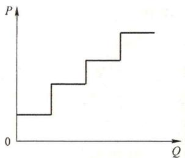
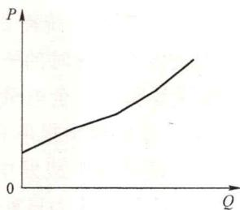

# 29. 发电侧有哪几种报价方式？在不同市场模式下发电厂商之间的竞价形式有哪些？

### 1. 发电侧的报价方式。

发电侧报价方式主要有报量不报价、报量报价形式。报量不报价形式是指市场成员申报出力曲线、不申报价格，多用于自计划机组的申报。报量报价形式是指市场成员申报量一价对，是常规机组的申报形式，根据市场规则要求，可以是单调递增的多段量价对，可以是阶梯形式或者斜率形式，可以是全天一组量价对报价或者分时段多组量价对报价。图1-13给出了发电商分时段阶梯报价和连续报价的报价方式。报量的“量”根据市场规则不同可以是发电电力或者是调增调减电力。因此，在不同市场模式下，发电厂商的竞价形式也有所不同。以下从全电量竞价模式、部分电量竞价模式和实时平衡机制三种市场模式描述发电厂商如何参与竞价。

### 2. 不同市场模式下发电厂商之间的竞价形式。

全电量竞价模式的特点在于发电侧市场主体各机组所发电量全部参与现货市场竞价，中长期交易电量、优先发电（包括可再生能源、省外购电、“保安全”、供热机组“以热定电”等）和基数电量以差价合约的方式结算。在全电量竞价模式下，发电厂商的日发电量将至少由三部分构成：

(a)

(b)

图1-13 发电商报价方式

（a）分时期阶段报价；（（b）分时期连续报价：(1) 公益性调节性发电计划+优先发电权电量；(2) 已签订的中长期交易电量分解到日的发电曲线；(3) 现货市场竞价中标电量。全电量竞价模式的具体运作流程为：(1) 发、用电双方自行商定的、分解到日的发电曲线作为竞价优化模型的外部输入条件，在计算中保持不变；(2) 依据传统调度模式，按照“三公原则”分解各发电厂商日合同电量（包括已签订中长期交易合同电量、公益性调节性发电计划、优先购电权电量），得到各时段合同电量曲线；(3) 各发电厂商参与全电量竞价，交易平台按照购电费用最小的优化模型完成市场出清，形成各时段现货出清电量、电价；(4) 电网企业结算发电厂商在某时段中标电量。全电量竞价模式可以有效地还原并体现电力的商品属性，优化资源配置，而且该模式下产生的价格信号促进双边以及多边市场的进一步发育、负荷侧积极响应。需要说明的是，全电量竞价并非不尊重市场成员已经签订的中长期合同，而是中长期合同与现货的差量部分按照现货价格结算。另外，全电量竞价模式为完全市场化的模式，能够实现最高的市场效率，但与过往制度的相容性不好。若在电力市场改革初期就一步到位地采用，必然会产生较多的利益受损者，无法实现“帕累托改进”，不符合利益调整渐进性的原则，严重时甚至可能会阻碍电力市场改革的推进。

部分电量竞价模式的特点在于发电侧市场主体部分电量在现货市场中申报，其余电量（优先发电量、基数电量、中长期交易电量）不参与现货市场申报，作为现货市场的边界条件物理执行结算，部分在现货市场中优先出清并物理执行。换言之，通常的部分电量竞价模式中，一部分电量通过传统的计划方式确定，计划电量不能转让；另一部分电量则采用市场的方式，通过竞争确定。部分电量竞价又可以划分为两种方式：(1) 所有市场成员都拿出一定比例的电量参与竞争；(2) 选取部分市场成员参与竞争。该竞价模式的主要优点在于简单易行，易于向多买方、双边交易为主的市场平稳过渡。但是也存在竞争不充分，价格信号不够准确，系统不能完全根据竞价结果来优化调度的问题。单纯的部分电量竞价模式虽然通过计划方式保障了部分市场成员的利益，有可能实现“帕累托改进”，但由于市场的竞争力度不足，导致市场效率较低，这也是通常所认为的部分电量竞价模式的最大缺陷。

实时平衡机制的主要功能是维持系统安全，其特点是在中长期交易物理执行基础上，市场成员申报增减出力报价信息，调度部门根据增减出力报价、系统不平衡功率和阻塞情况，以购电费用最小为目标，调整市场成员发用电计划。当发电有剩余时，系统需要将剩余的电量卖给平衡市场成员，参与平衡市场的成员减少发电量，这时的平衡市场被称为下调市场；当发电不足时，系统需要从平衡市场成员那里采购更多的电能，参与平衡市场的成员则需增加发电量，这时的平衡市场被称为上调市场。

在国外电力市场建设经验中，全电量竞价模式的典型案例为美国PJM现货市场。在PJM日前市场上，发电厂商需要申报所有的发电资源与交易意愿，市场将其与全网的负荷需求进行匹配，通过出清计算形成发电厂商的日前交易计划，并按照日前的节点边际电价进行全额结算。因此，可以认为日前市场的交易量即为全网交易量的$100\%$。发电厂商对于此前在中长期阶段所签订的双边交易与自供应（self-supply）合约，可以在投标时进行标识，即此部分电量将在出清时保证交易；双边交易与自供应合约的结算由购售双方自行完成。发电机组报价的经济构成有启动报价、最小负荷的电力及其报价、递增的电力报价曲线、辅助服务的报价（调整容量、旋转备用和补充备用容量）；机组的技术性参数包括发电机的启动时间、发电机的最小运行时间、发电机的有功功率功率极限、发电机的最小停机时间、发电机每天最多的启停次数、发电机的无功功率极限、发电机的负荷变化率。发电机组可以基于成本报价，也可以基于市场报价，基于市场报价一般有最高报价限额。

2000年底，英国开始实行新的电力市场交易模式，新市场模式关键的一部分就是引入了实时平衡市场。在该平衡市场下，系统调度员可以按照收到的平衡服务报价按照平衡调度费用最低为目标采购平衡服务。平衡服务提供者可能是有调节裕度的发电公司或配电公司。平衡服务报价包括增加发电报价和减少发电报价两部分，这两部分报价要同时申报。平衡市场由一系列不同交易时段的平衡交易组成，每个时段的平衡交易从交易执行前$4\mathrm{h}$开始至该交易结束。机组发电功率的增加或用户负荷的减少被称为offer；反之，机组发电功率的减少或用户负荷的增加则被称为bid。短期市场交易结束后，系统调度员可以获得下个平衡市场交易时段里的发电和负荷变化曲线，实时平衡市场就开始启动。实时平衡市场的交易过程可以分成4步描述：(1) 平衡市场成员向系统调度员提交报价；(2) 系统调度员根据需要选择平衡服务；(3) 平衡服务交易结果下达给相关的市场成员；(4) 不平衡结算。为了防止平衡市场成员具有过强的市场力而形成过高的平衡电价，英国平衡市场中采用了按机组报价结算而不是用日前现货市场的系统统一的边际电价结算。系统向提供offer服务的成员付费，向提供bid服务的成员收费。平衡调度费用按每个平衡市场的成员在每个交易周期内每个接受的bid/offer计算。

无论是中长期交易，还是现货交易，其顶层设计的重点都在于价格形成机制，价格机制直接影响到市场主体的报价行为、运行效率和市场力作用。电力现货交易价格机制有两种：(1) 按各市场主体的报价结算；(2) 按照边际出清价格结算。在两种价格机制下，市场交易都是按照机组或发电厂商的报价，由低到高分配发电负荷，直至满足系统供需平衡。不同之处在于，报价结算是按照实际报价进行交易，而边际出清价格则是以最后一台满足系统负荷平衡的机组报价为基准，将其作为边际价格进行结算。在按边际出清价格结算的电力市场中，无论发电企业报价高低，一旦被选中，一律按照边际出清价格进行结算，通常取被选中调度的发电厂商中最高报价为边际出清价格。

在PAB机制中，发电厂商的结算电价由自己的报价决定，故利润也由其自身决定，所以在报价时除了要考虑能否成交外，还需要考虑自己的目标利润，总体上各发电厂商的报价必然要高于边际价格体系中的报价。尽管竞价个体的报价较高，但由于MCP机制中各个体结算电价取决于最高报价，导致在MCP结算方式下平均电价将上升。有文献在理论上证明了在相同的市场策略的前提下，按照机组实际报价结算方式下的总购电费用较小。因此，PAB的价格信号不如MCP机制清晰，但相对而言市场价格的波动幅度较小。

