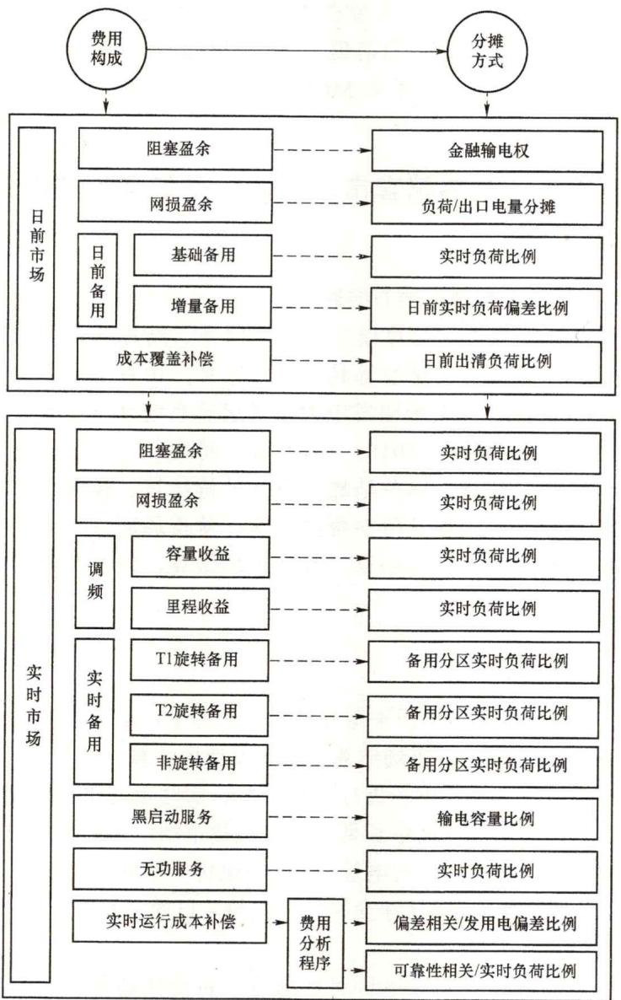
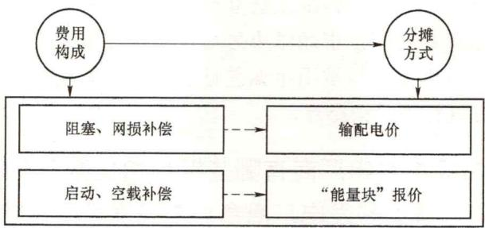

# 30. 电力现货市场及其配套市场的结算是如何构成的？国外是如何结算的？

（1）电力现货市场及其配套市场的结算内容。

电力现货市场及其配套市场结算模式、结算原则、结算流程等与市场模式、市场品种、各周期市场的金融或物理属性等具有很大关系，由各个地区、各个市场的规则相应明确。从结算科目来看，《关于印发电力市场运营系统现货交易和现货结算功能指南（试行）的通知》（发改能源〔2018〕1518号）将现货市场结算分为电能结算、辅助服务结算、需求侧响应结算、偏差结算、成本补偿结算、盈余与平衡结算、输配电费结算、容量市场结算、管理费及附加费结算等。从市场周期来看，电力现货市场结算可包括日前市场结算、日内市场结算、实时市场结算，以及与现货市场配套的中长期市场结算。

（2）国外结算方式。

1）美国PJM市场结算。

PJM市场的结算科目构成及费用平衡分摊方式如图1-14所示。

a. 电能市场结算。PJM 电能市场结算包括日前市场结算、实时市场结算，也可代理市场主体的双边合约结算。日前市场进行全量结算、实时市场进行偏差电量结算、双边合约以差价合约方式结算，以联动中长期市场与现货市场，帮助市场成员规避现货市场风险。电能市场的结算形式为：合约电量 $\times$ （合约电价-差价合约参考节点价格）+日前市场电价 $\times$ 日前市场净交换电量 $+$ （净交换计量电量-日前市场净交换电量） $\times$ 实时市场电价。

发电侧市场主体通常按照节点电价进行结算。负荷侧通常采用负荷聚类方式，将负荷分配给具体的负荷服务实体LSE，并进一步根据聚合的定义分配至具体的负荷总线，以确定LSEs在每个节点的负荷量，负荷结算价格由可定价负荷的加权平均节点电价计算。

b. 阻塞盈余结算。当所有的发电和用户均按照所在节点的电价结算时，市场阻塞价格分量总结算结果为阻塞盈余。PJM等典型市场采用金融输电权工具进行阻塞盈余分摊。金融输电权从经济补偿原理出发，与输电网络物理使用权分离，当网络阻塞时其所有者获得经济补偿，从而获得价格的相对稳定性。按照输电容量定义的不同，金融输电权分为点对点金融输电权和关口金融输电权，关口金融输电权又称基于潮流的输电权。针对金融输电权有效时段的不同，金融输电权分为高峰时段金融输电权、低谷时段金融输电

权和24h金融输电权。

图1-14PJM结算科目及费用平衡分摊方式

c. 网损盈余结算。网损盈余同样来源于节点电价理论。美国 PJM 电力市场将网损费用计入节点边际电价中，通过边际网损系数来计算节点网损电价，明确网损对节点电价和竞价交易的影响。由此，PJM 将网损费用分摊至所有的网络服务使用者，避免了用户之间的交叉补贴，能够提供合理的经济信号。通过边际网损系数回收的网损费用，即网损盈余，该费用一般大于实际网损费用，PJM 等典型电力市场将网损盈余按照实时负荷和出口交易电量的比例分摊至负荷服务实体。

d. 成本补偿结算。成本补偿费用包括运行成本补偿和机会成本补偿。

运行成本补偿用以保证机组参与市场的整体收益非负，通常用于补偿机组启停成本，

以确保机组跟随调度指令运行，包括了日前市场运行成本补偿以及实时市场运行成本补偿。运行成本补偿费用通过机组报价成本扣减机组现货市场收益得到，报价成本包括启动报价成本、空载报价成本和电能报价成本。

机会成本补偿旨在补偿机组的机会成本损失。如果调度要求机组在实时市场减少发电出力，而根据发电单元的实时市场报价，该机组的发电出力本应更高，这可能带来机会成本损失。若机组在实时市场响应调度指令压缩出力，则机组在电能市场损失的收益扣减机组节省的发电成本剩余部分即为机组机会成本补偿费用。

e. 辅助服务结算。辅助服务市场结算主要包括调频、日前计划备用、实时同步备用（运行在经济状态的同步备用资源称为T1资源，运行在非经济状态的同步备用资源称为T2资源）、非同步备用几部分内容。

辅助服务依据辅助服务出清结果和实际执行结果结算，例如调频结算分为容量费用和里程费用，容量费用依据出清容量、出清容量价格、调频性能归一化指标结算，里程费用依据实际调用里程、出清里程价格、调频性能归一化指标结算。

调频义务由各负荷服务商（LSE）承担，其每小时的调频义务依据该LSE的实时负荷比例进行分配。

f. 税费结算。PJM 对于输配电费，计划安排、系统控制和调度服务，黑启动等运营服务、输电服务按照关税的方式结算。例如 PJM 提供控制区管理服务、金融输电权管理服务、市场支持服务、频率响应管理服务、容量资源和义务管理服务、先进二次控制中心 6 项，以及向美国联邦能源管理委员会（FERC）、北美电力可靠性公司（NERC）、PJM 州组织公司（OPSI）、市场监督部门（MMU）支付的费用等以税率的方式进行叠加计算。

2）英国电力市场结算。

英国电力市场中，阻塞网损等费用以输配电价方式回收，补偿费用通过报价回收，如图1-15所示。

图1-15 英国电力市场费用平衡分摊方式

a. 期货交易结算。在英国电力市场中，英国电力交易机构[英国电力交易机构（APX）]与纳斯达克交易所提供标准化的期货合同交易，除了发电商、售电商等直接参与者外，不生产或消费电能的非直接交易商（如银行等）也可参与期货交易，通过套利、投机的方式赚取利润。期货交易由具体的交易组织机构进行金融结算。

b. 中短期交易结算。中短期交易主要是为应对发电商、售电商用电量预测的偏差而

进行的短期补充交易，交易双方通过双边协商或集中交易达成。英国电力交易机构（APX）以月内短期交易为主，对于在英国电力交易机构（APX）中开展的中短期交易，由英国电力交易机构（APX）按照交易合约规定的交割点，经系统运营机构确认交易完成，英国电力交易机构（APX）直接完成结算。

c. 日前现货市场交易。英国电力市场的电力供给则较为充足、调节能力较强，且电网阻塞程度相对较轻，市场交易的经济性与电网运行的安全性可相对解耦。因此，英国电力市场更重视电能商品在中长期市场上的流动性，现货市场的定位更多为提供一个集中的电能购买平台，并允许市场成员对已签订的交易计划进行偏差修正，交易量较小。日前交易由两个电力交易所分别组织，即英国电力交易机构（APX）和北欧与纳斯达克联营现货电力交易所（N2EX），市场成员自愿选择参与。英国电力交易机构（APX）组织的电子交易于日前10:50关闭，11:50完成出清计算并公布交易结果；纳斯达克联营现货电力交易所（N2EX）则在日前09:30闭市，并于10:00前向市场公布出清结果。交易所组织的日前交易，均采用了边际出清的价格机制，适用于交易所中所有出清的交易电量。电力交易所是所有交易的中心对手方；所有的合同都以匿名的方式进行交易，然后以会员的名义进行清算和结算。所有成员都必须以现金或信用证的形式在任何时候以超过未偿付风险的方式提供担保。集中撮合交易结束后，交易所将交易信息提交给平衡电量结算公司Elexon和调度机构，为未来平衡电量的计算提供依据。

d. 不平衡结算。平衡市场的结算可以分为信息不平衡结算和能量不平衡结算。信息不平衡结算用来应对市场成员申报的最终合同曲线、调度所接受的调节量与实际出力之间不符的情况，其结算资金是在实时平衡调度过程中，平衡市场成员未能完全按其被接受的买方投标（bids）和卖方投标（offers）进行出力（或负荷）调整，对其差异部分（这里称为“未发送电量”）的罚款。如果一个平衡市场成员同时有多个offers（或bids）被接受，对“未发送电量”的惩罚规则将按offer价格由高到低的顺序（或bid价格由低到高的顺序）进行惩罚计算。该市场机制从建立到目前尚未真正启动运行，信息不平衡费用为零。能量不平衡结算是在平衡市场结束之后，市场结算机构根据实测电量、合同电量、调度采纳的平衡服务电量进行发用电偏差计算，对平衡资源提供方支付平衡服务补偿，同时对平衡责任方进行不平衡结算。

