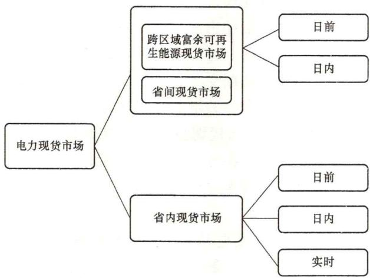

# 53. 当前我国电力现货市场有哪些品种构成？各自承担哪些功能？

从交易范围看，我国电力现货市场由省间现货市场和省内现货市场构成。由于目前我国电力现货市场建设初期，省内现货市场还未在全国范围建设完成，省间现货市场正在建设，目前正在运行的跨区域省间富余可再生能源电力现货市场是省间电力现货市场的雏形，也是省间电力现货市场的过渡品种。

按照交易时间的维度，电能量批发市场按其交易周期长短，通常可分为电力现货市场和电能量中长期市场（专指实物交易属性的电力中长期市场）。电力现货市场是在临近电力执行阶段，市场主体根据自身实际发用电需求对发用电计划进行即时调整的市场，我国电力现货市场包括日前、日内、实时市场。我国省间现货市场包含日前、日内市场，省内现货市场包含日前、日内、实时市场，如图2-1所示。

图2-1 我国电力现货市场构成

## （1）省间电力现货市场构成及功能。

2015年国家发展改革委下发《关于完善跨省跨区电能交易价格形成机制有关问题的通知》（发改价格〔2015〕962号），提出跨省跨区送电可以通过协商或市场化交易方式确定送受电量、价格，《可再生能源发电全额保障性收购管理办法》（发改能源〔2016〕625号）中允许可再生能源企业参与市场竞价，为开展跨省区日前交易提供了政策依据。2016年11月7日，国家发展改革委、国家能源局正式发布《电力发展“十三五”规划》（下文简称为《规划》）。《规划》明确提出深化电力体制改革，完善电力市场体系的任务。2017年8月28日，国家发展改革委、国家能源局发布了《关于开展电力现货市场建设试点工作的通知》，希望进一步推动电力市场发展，同时通过现货市场缓解可再生能源消纳矛盾。

跨区域省间富余可再生能源现货市场是完善我国电力市场建设的核心内容之一，也是有效促进可再生能源消纳、减少弃风、弃光等现象发生，并确保电网安全运行的必要激励机制。

跨区域省间富余可再生能源电力现货市场由国调中心负责组织运营，主要开展富余可再生能源发电交易，利用通道富余能力，促进清洁能源的大范围消纳，实现资源优化配置。跨区域省间富余可再生能源电力现货市场包含日前市场和日内市场两部分。跨省区现货市场主要组织可再生能源跨省区外送电能交易。送端可再生能源发电企业按照政府主管部门明确的弃水弃风弃光电能界定标准，根据富余发电能力，按时段申报售电“电力-电价”曲线；受端电网企业按照政府主管部门明确的购电报价策略，按时段申报购电“电力-电价”曲线；大用户、售电公司可自行申报“电力-电价”曲线。买方申报电价和电力考虑输电电价和线损后折算到送端交易计量关口，与卖方报价集中出清，出清过程考虑输电通道安全约束，按照边际价格结算。

跨区域省间富余可再生能源电力现货市场作为省间电力现货市场的雏形，对省间电力现货市场有其探索意义和指导作用。积累了跨省区现货市场运行经验。清洁能源是未来跨区输电的主要电源，清洁能源发电具有较大的不确定性，日前和日内现货交易是其跨省区外送的一种重要交易形式。通过组织清洁能源跨省区日前交易，可以探索建立日前调度计划、日前交易和安全校核协调运作的工作模式，为未来在全网范围建立清洁能源跨省区现货交易机制积累经验。

省间电力现货市场在跨区域省间富余可再生能源电力现货市场的基础上扩大市场范围，由“跨区域省间”拓展为全部省间范围；增加市场主体，送端市场主体在可再生能源基础上新增火电企业、核电企业。

省间电力现货市场也包含日前市场和日内市场两部分，支持符合省间电力现货市场准入条件的所有市场主体开展跨省电力现货交易。省间电力现货交易的交易品种主要为电能量交易。

省间电力现货市场在落实各类中长期交易的基础上，建立对中长期交易的现货调节机制，考虑省间交易以直流输电系统为骨干的物理特性，结合省间、省内关键交流断面，构建由交易节点、交易路径（跨省区交直流联络线和省内交流输电断面）共同组成的省间现货交易网络模型。充分利用通道的富余能力，实现富余能源资源大范围优化配置，实现跨省区电力余缺互济，促进可再生能源消纳。

省间电力现货市场的建设有以下4个功能：

1）促进电力体制的改革进程。省间电力现货市场促进当前调度模式下电力现货交易的开展，充分发挥市场在资源配置中的决定性作用，从社会福利、促进发展、安全稳定、能源效率等方面提升现货交易的意义。健全省间电力现货市场，是我国电力市场总体体系中的重要组成部分，对建立完善、立体的电力市场体系具有重要作用，为将来建设完整统一的电力市场体系打下坚实基础。

2）促进省间、区域间电力资源优化配置，降低社会成本。充分利用跨区跨省联络线输电能力，促进资源大范围优化配置和可再生能源大范围消纳。统筹全国市场空间，在省间中长期交易基础上组织省间电力现货交易，充分发挥各类资源运行调节能力，促进可再生能源大范围消纳利用，推动能源结构转型优化。

3）提高可再生能源的消纳水平。在日前和日内的时间尺度，为可再生能源建立一个跨省的交易平台，破除可再生能源消纳的体制机制障碍，实现可再生能源供给与需求的全面匹配，尊重供需双方的意愿，挖掘可再生能源跨区省间交易的空间，在更大范围内为可再生能源寻找需求方，实现需求与供给的有效匹配，将有效缓解可再生能源发电大省的消纳压力，缓解我国当前面临的“三弃”难题，促进大范围能源资源优化配置，降低社会发电成本，提升固定资产投资的利用率。

4）提升电网运行的安全水平。风、光等可再生能源发电具有波动性、间歇性等不稳定特征，再加上用电负荷不平均，峰谷偏差超过安全阈值限制，具有一定的安全风险。在保障风、光等可再生能源消纳的同时，通过扩展用户类型，允许火电、核电发电企业参与省间现货市场，以市场手段协调不同电源，保障电网安全稳定运行。

## （2）省内电力现货市场构成及功能。

我国省内电力现货市场根据时间维度划分为日前市场、日内市场和实时市场，以发电成本最小为目标，优化省内资源配置，确定省内机组组合和发电计划。目前我国省内市场试点建设都包括日前、实时市场，其中山东省还建设了日内市场。省内现货市场根据不同时间尺度来发现本省电力价格。

1）日前市场：通过集中市场竞争，决定次日的机组开机组合，以及每台机组的发电出力曲线，实现电力电量平衡、电网安全管理和资源优化配置，发现电力价格。

2）实时市场：实现电力实时平衡的市场化调节、电网安全约束的市场化调整，在满足安全约束的条件下对发电机组进行最优经济调度，实现全系统发电成本最优，同时发现实时电力价格。部分省份的调峰市场也通过现货市场中的实时市场或平衡机制实现。实时市场承担调峰功能。

省内电力现货市场的建设有以下5个功能：

1）发现价格、激励响应。可真实反映本省电力商品在时间和空间上的供需关系，引导发用电资源响应市场格波动，提升电网调峰能力、缓解阻塞。

2）促进竞争、优化配置。以集中出清的手段促进了电量交易的充分竞争，实现了电力资源的高效、优化配置。

3）落实交易、调节偏差。落实中长期合同交割与结算，以现货市场为核心的电力电量平衡机制调节发用电偏差，同时为中长期交易提供价格风向标。

4）保障运行、管理阻塞。形成与电力系统物理运行相适应、体现市场成员意愿的交易计划，为阻塞管理和辅助服务提供调节手段和经济信号。

5）引导规划、量化决策。分区、节点电价能够有效引导电源、电网的合理规划，为建设投资提供量化决策依据。

