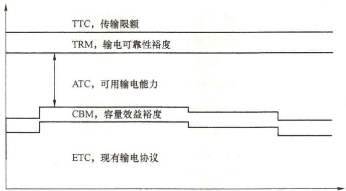

# 58. 什么是可用传输容量？ATC 在国内外电力市场是如何应用的？

可用输电容量（available transmission capability，ATC）指电网在已有交易或合同基础上可进一步用于交易的剩余输电容量（可包括电力和电量）。一般来说，可用传输容量指两个区域之间的总传输容量在考虑传输裕度、扣减通道已安排的交易电量后还剩余的传输容量。其中，总传输容量指考虑系统物理约束（包括热稳定极限等各类约束）情况下的最大传输容量。

可用传输容量的作用在于为市场交易的参与者提前提供市场交易在传输容量方面的边界信息，市场主体可据此进行预判和决策从而开展交易。在国外典型电力市场中也有可用传输容量的概念，以美国和欧洲为例分别进行说明。

# （1）美国。

1995年，北美电力系统可靠性委员会（NERC）统一了一系列关于输电能力的定义，并同时给出详细的解释、计算指导和规范。其中可用输电能力是指互联电力系统在满足3个系统约束下，通过两个区域间的所有线路和路径，从送端到受端可用于商业使用的输送最大能力。ATC的计算公式如下，图2-2展示了各分量之间的相互关系。

图2-2ATC计算示意图

$$
\mathrm {A T C} = \mathrm {T T C} - \mathrm {T R M} - \mathrm {C B M} - \mathrm {E T C}
$$

式中，TTC（total transfer capability）为最大输电能力，TTC是电力系统总的输电能力，是系统在满足事先定义的各种安全稳定约束与故障条件下，可以从一个区域到另一区域或者从一点到另一点之间可以传输的最大功率；计算TTC通常考虑三种安全约束条件，分别是设备的热容量约束、系统安全稳定约束和节点电压约束，TTC的值一般取这三种情况所对应的最大输电能力的最小值。

输电可靠性裕度（transmission reliability margin，TRM）反映了系统的各种不确定因素对电力系统输电能力的影响，是为系统不确定因素在合理范围内波动而预留的那部分输电能力。TRM主要考虑了各种电力设备的常规检修情况、较为剧烈的负荷波动行为、

变压器主抽头的调节情况以及天气的变化对电力系统运行的影响等。除此之外，TRM 还与计算 ATC 所选断面的时间跨度有关，若要研究一个较长时间跨度下系统的 ATC，就要考虑该时间段内可能发生的所有不确定性因素的各种合理组合的情况，所需要的 TRM 也越大。实际应用中，TRM 没有一种明确的计算方法，经常根据所选取的时间跨度的长短，取 TTC 的一个固定百分比作为系统的 TRM，计算方法比较简单，计算出的 TRM 值比较保守。

现有输电协议（existing transmission commitments，ETC）指输电网络中已经签订了的那部分输电合同所占用的电网的输电能力，根据现有输电合同的类型和稳定程度，可以将输电合同划分为计划输电合同和预约输电合同，以及可撤销的输电合同和不可撤销的输电合同。虽然这些合同中的电能传输约定有的正在进行，有的还未发生，但是其所约定的输电协议已经生效，在预测系统ATC时，需要在相应的时间段内，在TTC中将其扣除。而在系统的负荷高峰时期，电力网络中的输送功率过大，若此时系统的安全可靠性受到威胁，可以适量地削减部分可撤销输电合同，所以特殊情况下ETC可以转化为ATC。

容量效益裕度（capacity benefit margin，CBM）这部分输电能力是为了保障那些不可撤销输电协议的顺利执行而预留的。与TRM一样，在计算ATC时也需要在输电网络的TTC中将CBM扣除。这部分备用的输电能力对电力系统的供电可靠性很重要，当电力系统中有发电机退出运行等使电力系统电源容量削减的故障情况发生时，CBM所预留的这部分输电能力就用于与该系统相连的其他系统将电能输送到该区域的重要负荷中心，以满足那些不可撤销的输电协议。由定义可知，CBM与TRM都是为了保障电力系统的安全可靠性而预留出的输电能力，TRM针对的是较大范围系统的安全运行的考虑，而CBM专门针对较小范围内的系统电源的供电可靠性。确定CBM需要考虑三种因素：①为保证区域的供电可靠性水平，外围电网需要提供的电力容量支持；②为区外电网输送的功率能够进入区域支援该区域的用电所预留的输电能力；③根据该区域与外部电网功率往来的功率容量以及相应联络线、电力流通路径的地理分布情况，合理分配CBM的预留值。CBM通常取区域内发电机组的最大容量的一个比例值，或者与CBM的计算类似，由TTC的一个固定百分比来确定。

# （2）欧洲。

欧洲输电系统运营商协会（european transmission system operators，ETSO）对欧洲内部电力市场（internal market of electricity，IEM）中的跨国电力传输能力进行了定义。其主要的定义与NERC对可用输电容量的定义相似，计算方式与北美相比进行了一些调整，主要包括净传输容量（NTC）、系统可用传输能力（ATC）等概念。

# 1）净传输容量（NTC）。

计算方式是由用最大输电容量TTC减去输电可靠性裕度TRM。NTC的计算公式为：

$$
\mathrm {N T C} = \mathrm {T T C} - \mathrm {T R M}
$$

式中，TTC是指考虑到热稳定约束、电压约束等安全性约束后，不会影响系统安全性条件下系统两区域A、B之间最大可行功率交换。而TRM反映不确定性因素对互联系统区域间输电能力的影响，涵盖了市场主体的不完善信息和意外的实时事件导致的联络

线潮流预测的不确定性。系统运营商可以根据过去的经验或使用统计方法对TRM进行评估。在最大安全输电容量中，刨去不确定因素对传输容量裕度的影响，剩余容量部分就是净传输容量NTC。

2）系统可用传输能力ATC。

计算方式是从净传输容量NTC中扣除通知传输流NTF。ATC的计算公式为：

$$
\mathrm {A T C} = \mathrm {N T C} - \mathrm {N T F}
$$

其中，根据市场主体的发电计划，可以得到发电方案带来的传输线之间的相应潮流与所需容量，这些“已分配”容量统称为通知传输流NTF。欧洲市场中定义的NTF类似于北美电力市场中的容量效益裕度CBM与无法更改的输电服务所需输电能力ETC之和，即： $\mathrm{NTF} = \mathrm{CBM} + \mathrm{ETC}$ 。ETC为现有输电协议（包括零售用户服务）占用的输电能力。CBM定义是指为确保ETC输电服务顺利执行时输电网应当保留的输电能力。

NTF与ATC是动态更新的，随着输电容量预订/分配过程的进行，TSO可以根据新提供的市场主体发电计划信息更新其潮流计算，以完善其对安全问题的评估。由于市场主体和调度机构之间在实时交换数据，因此，随着实时操作的接近，输电容量事前计算的准确性会提高，最终，调度机构将评估系统之间的剩余可用传输容量（ATC）。

可用传输容量（ATC）主要应用于大范围的交易优化出清中。在交易组织中考虑相关输电通道剩余可用传输容量（ATC），可以确保交易出清结果不会导致通道阻塞，从而使交易出清结果在物理运行中能够可靠地执行，不会影响到系统的安全性。

（3）中国。

在我国，ATC已开始应用于省间交易的组织，用于促进清洁能源的消纳和大范围资源优化配置。

1）在现货市场组织方面，我国已在跨区域省间富余可再生能源电力现货市场中，完成了基于ATC的跨区域的电力交易的组织开展，通过挖掘区域间通道可用输电能力，促进了西南及三北地区富余可再生能源消纳，缓解了弃水、弃风、弃光问题。

2）在中长期交易组织方面，我国已完成了计及ATC的省间中长期交易软件研发，并部署到了新一代电力交易平台上。计及ATC的省间中长期交易软件，能够在交易出清的同时考虑输电通道剩余可用传输容量，使出清结果满足电网安全约束，能够极大地提高省间中长期交易的可执行性，有利于提升通道利用率和交易的组织效率，为在中长期组织开展高频次交易创造了条件，有利于促进清洁能源的消纳，助力能源转型和“双碳”目标实现。

