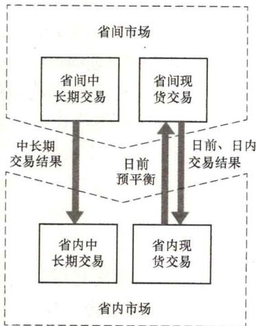

# 65. 省间市场与省内市场是如何衔接的？

我国经济社会发展以省为主体，电力工业长期以来形成了以省为基础的电力供应格局，能源电力发展规划、经济运行和安全生产等均按省实施管理。同时，我国能源资源与负荷分布不均衡的国情以及发展可再生能源的要求，客观上决定了全国统一电力市场体系应以省间、省内市场“统一市场、两级运作”起步。因此，省间与省内现货市场需要在功能定位、交易时序、偏差处理、安全校核及阻塞管理等方面做好统筹衔接，省间与省内市场衔接关系如图2-3所示。

省间、省内市场采取“分层申报、协调出清”模式。首先省内依据省间送受电预计划以及本网运

图2-3 省间市场与省内市场衔接示意图行实际，形成省内开机方式和发电计划的预安排，在此基础上组织省间现货交易。省间交易形成的量、价等结果作为省内交易的边界，省内交易在此基础上开展。为保证市场在时序上的良好衔接，建议省间现货市场开展日前、日内交易，省内现货市场开展日前、实时交易。

（1）省间日前现货交易与省内日前现货交易时序衔接流程。

1）预计划下发。$D - 2$日在市场规则规定的时限前，国调中心根据中长期交易结果制定并下发跨区联络线$D$日96时段预计划，编制并下发直调机组$D$日96时段发电预计划；网调根据中长期交易结果制定并下发省间联络线$D$日96时段预计划，编制并下发直调机组$D$日96时段发电预计划。

2）交易前信息公告。$D - 1$日在市场规则规定的时限前，调度机构向市场主体发布次日系统负荷预测、可再生能源发电能力预测、主网设备停电计划、联络线可用输电容量等辅助交易决策信息。

3）省内预出清（预平衡）。$D - 1$日在市场规则规定的时限前，市场成员参加省内市场的电力一价格曲线申报；对于已经开展省内现货市场的省份，由省调进行省内日前现货市场预出清，对于尚未开展省内现货市场的省份，由省调进行省内预平衡；各省根据预出清或预平衡结果将机组预计划、负荷预测等数据向国调中心、网调进行上报，并将省内预出清或预平衡结果、省内电力平衡裕度和可再生能源富余程度向相关市场主体进行发布。

4）交易申报。$D - 1$日在市场规则规定的时限前，市场主体可在省间电力现货市场技术支持系统终端上进行电力一价格曲线申报；省调对省内市场主体申报数据进行安全性校验，并将省内各市场主体报价曲线上报至国调中心；国调中心、网调对直调发电企业的申报量进行预校核，直调发电企业通过技术支持系统将报价曲线上报至国调中心。

5）省间市场出清及跨区联络线计划编制。$D - 1$日在市场规则规定的时限前，国调中心和网调组织省间日前现货市场集中出清，形成考虑安全约束的省间日前现货市场出清结果，将出清结果纳入联络线日前计划，并在经过安全校核后，将省间日前现货市场出清结果向相关省调及直调发电企业进行发布。

6）省间联络线计划编制。$D - 1$日在市场规则规定的时限前，网调组织区域内辅助服务市场出清，形成考虑安全约束的出清结果，将出清结果向相关调度机构和直调机组进行发布，并将省间联络线计划向省调下发。

7）省内日前发电计划编制（或省内日前现货市场组织）及结果发布。D-1日在市场规则规定的时限前，各省调根据上级调度机构下发的联络线计划，编制省内日前发电计划或组织省内日前市场及辅助服务市场出清。市场出清结束后，省调向市场成员发布市场出清结果。

（2）省间日内现货交易与省内实时现货交易时序衔接流程。

1）交易前信息公告。$D$日针对某一交易时段，在市场规则规定的时限前，调度机构向市场主体发布超短期系统负荷预测、可再生能源发电能力预测、主网设备停电计划、联络线可用输电容量等辅助交易决策信息。

2）交易申报。$D$日针对某一交易时段，在市场规则规定的时限前，市场主体在省间电力现货交易技术支持系统终端上申报日内交易段内新增交易意愿的电力一价格曲线；省调对省内市场主体申报数据进行合理性校验，并将各市场主体报价曲线上报至国调中心；国调中心、网调对直调发电企业的申报量进行预校核，直调发电企业通过技术支持系统将报价曲线上报至国调中心。

3）省间市场出清及跨区联络线计划编制。$D$日针对某一交易时段，在市场规则规定的时限前，国调中心、网调组织省间日内现货市场集中出清，形成考虑安全约束的省间日内现货市场出清结果，将出清结果纳入联络线日内计划；并在经过安全校核后，将省间日内现货市场出清结果向相关省调及直调发电企业进行发布。

4）省间联络线计划编制。$D$日针对某一交易时段，在市场规则规定的时限前，网调组织开展区域内辅助服务交易，将出清结果向相关调度机构和直调机组进行发布，并将省间联络线计划向省调下发。

5）省内实时发电计划编制（或实时市场组织）及结果发布。$D$日针对某一交易时段，在市场规则规定的时限前，省调根据上级调度机构下发的联络线计划，编制省内实时发电计划或组织省内实时市场及辅助服务市场出清。市场出清结束后，省调向市场成员发布市场出清结果。

