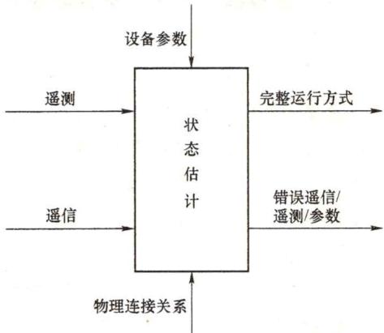

# 98. 什么是电网状态估计？状态估计在现货市场中的作用是什么？

## （1）电网状态估计。

状态估计是电网能量管理系统中用于电网状态感知的基础应用模块，主要功能是综合电力系统的各种量测信息，估算出电力系统当前的运行状态，为各类应用软件提供高可靠性的完整运行方式数据。数据可靠性方面，电网的各类运行状态信息主要是通过远动装置采集后传送至调度机构，由于远动装置的误差及在传送过程中各个环节所造成的误差，此类数据往往存在不同程度的误差和不可靠性。数据完整性方面，电网建设初期由于测量装置在数量上或种类上的限制，调度机构往往得不到完整的、足够的电力系统计算分析所需要的数据；近年来随着电力系统建设的逐步推进，量测装置的数量已基本不再是数据质量的制约，但量测采集装置或通信故障仍可能对数据的完整性带来影响。为解决上述同题，除了不断改善测量与传输系统外，还可采用数学处理的方法来提高测量数据的可靠性与完整性，电力系统状态估计正是为适应这一需要而诞生。

自19世纪60年代F.C.Schwepe等提出电力系统状态估计概念以来，经过几十年的发展，电力系统状态估计已成为能量管理系统的重要组成部分，是电力系统分析控制软件的基石。其主要任务是利用实时量测系统的冗余性，应用估计算法来检测与剔除坏数据，自动排除随机干扰引起的错误信息，提高数据准确性和一致性，并对部分缺失的数据进行估计，以此来为高级分析控制软件提供可信的实时潮流数据。状态估计的主要功

图3-1 状态估计功能示意图能如图3-1所示。

状态估计的输入数据主要包括网络模型参数以及系统遥测、遥信数据，输入数据经过状态估计分析计算，得到估计后的完整系统运行方式数据并输出，同时状态估计对辨识出的错误数据进行提示。状态估计主要包含如下功能和作用：

1）提高数据精度。状态估计根据网络方程应用最佳估计标准（可采用最小二乘准则等）处理系统采集来的生数据（系统直接采集的数据包含误差，因此为生数据），并剔除或修正其中的不良数据，从而提高可靠性。

2）提高数据完整性。状态估计根据当前能够获取的量测值推导出其他相关的难以测量的电气量，如通过有功功率测量值推导节点电压相角等。

3）网络连接方式辨识或开关状态辨识。为了保证运行方式的正确性，可以利用遥测量估计电网的实际开关状态，找出并修正因为偶然因素出现的开关刀闸的错误状态信息。

4）参数估计。对于某些未知或可疑的参数，将它们组成状态量，根据实际量测数据，利用欧姆定律和基尔霍夫定律估算出此类参数数值，找出可疑参数。

（2）状态估计在现货市场中的作用。

在支撑电力现货系统运行方面，电网状态估计具有很重要的价值。与数据采集与监视控制系统（SCADA）原始量测值相比，状态估计计算结果具有更好的准确性和完整性，传统调度控制系统的各类分析计算软件都以状态估计提供的准实时断面为基础进行后续分析计算。现货技术支持系统同样需要以状态估计结果作为数据基础进行分析和计算：现货系统的灵敏度分析功能以状态估计提供的实时断面为基础，叠加检修计划后进行灵敏度计算，所计算出的灵敏度结果是优化出清的网络约束处理依据；现货系统的安全校核功能以电网状态估计结果为基础，叠加负荷预测、机组出清结果、检修计划等信息，形成各出清时段的预想运行方式，并对各预想运行方式进行安全校核分析；现货系统通过状态估计所提供的历史断面，分析各机组的连续运行时间或连续停机时间，从而判断该机组是否满足开停机要求。

在对电网运行的安全约束考虑方面，实际调度运行过程中，为了简化流程、提高控制效率，一般采取通过大量分析计算将复杂的控制规则“降维”处理成稳定断面的功率控制的方法。而现货优化出清过程中将断面功率控制进一步进行线性化处理，根据稳定断面对机组和负荷的灵敏度将断面功率控制在限值以内。为防止此类近似偏差对系统的安全运行和市场的有序开展带来影响，需对现货出清计算结果进行进一步安全校核。

对现货出清结果进行安全校核需要对计划运行方式进行大量的分析计算，包括潮流计算、静态安全分析、动态稳定、暂态稳定和电压稳定等。其中潮流计算是各类分析的基础，并且能为后面各种稳态分析计算和分析提供初值。潮流计算需要一整套运行方式数据，而现货出清结果中仅包含未来时段的机组有功功率、负荷有功功率、联络线有功功率。潮流计算所需的其他数据，如电网拓扑结构、电压无功等数据，大多需要从状态估计结果中进行获取和整合。上述数据对形成完整的运行方式数据缺一不可。

电网拓扑结构方面，对出清结果进行安全校核，首先要形成未来时段的网络结构，这就需要获得开关刀闸的状态。针对未来时段开关刀闸状态的不确定性，常见的处理方法包括以下两种：第一种是根据相似日生成未来运行方式，采用历史相似日的电网运行拓扑结构来代替未来电网拓扑结构；第二种是在电网实际运行方式的基础上叠加未来时段的检修计划。第一种方式多见于学术研究及时间尺度较长的未来运行方式生成。由于电力现货市场主要处理日内或者次日的运行方式，时间尺度较短，运行方式的不确定性小，因此实际常用的方法是第二种，即在电网实际运行方式的基础上叠加未来指定时段的检修计划，而电网的实际运行方式主要来源于状态估计计算结果。现货出清计算时，首先获取电网的实时运行状态作为初始状态，在初始运行状态的基础上，按检修计划将对应设备在指定时段进行投退、操作相关的开关刀闸，并由最终结果生成出清时段内的电网运行网络拓扑结构。

无功功率、电压数据方面，现有现货出清均仅针对有功功率功率进行出清计算，不涉及无功功率、电压范畴。如仅采用直流潮流对电力现货出清结果进行潮流安全校核，则无需补充无功功率、电压类数据。实际上，国外部分电力交易机构对出清结果的安全校核都采用直流潮流。但考虑到直流潮流的精度问题，以及更进一步开展电压稳定分析等校核需求，安全校核还需要补充电机端电压、变压器分接头以及电容电抗器补偿情况等数据。考虑到电网运行方式的相似性，该类数据可以根据以往电网运行状态进行拟合。现货出清计算多以五分钟或十五分钟为时间间隔，将出清时段的运行方式分解成若干个运行点。而状态估计一般以五分钟为周期保存电网运行的历史数据，其中包含负荷无功功率、变压器分接头位置等各类详细信息，因此状态估计保存的历史数据可以满足无功电压数据的拟合需要。在进行负荷无功功率拟合时，可采用等功率拟合或者等功率因数拟合等方式估算各出清时段的负荷无功功率大小。发电机无功功率拟合可分为两种，设置为PV节点的发电机无需计算无功功率，直接根据设定极端电压参与计算；设置为PQ节点的发电机可采用与负荷无功功率类似的方式计算各时段的无功功率。

除状态估计外，电网运行数据的另一大类数据源是SCADA量测数据，但现货系统的安全校核不宜直接采用SCADA数据作为数据基础。从数据准确度而言，SCADA数据是直接量测数据，与状态估计结果相比，大多测点的SCADA数据与真实值更为接近，但SCADA数据中可能存在的少数坏数据，这会导致安全校核计算无法执行，或对系统运行状态造成误判。例如部分量测数据可能会存在异常值或者毛刺，导致全系统的功率出现很大的不平衡量，无法进行潮流等安全分析；部分关键遥信量如关键特高压线路开关遥信值的偶然错误会导致全系统潮流异常分布，造成计算结果的不可用。状态估计可对此类坏数据进行辨识与剔除，能有效提高现货安全校核的实用性。

此外，由于状态估计结果是大多数电力调度应用软件分析的数据基础，因此状态估计结果的偏差对各类应用分析结果都有不同程度的影响。传统调度计划模式下，此类影响主要体现在系统运行状态分析偏差、安全裕度分析偏差等，会对系统安全运行带来不良影响。而市场模式下，状态估计结果的偏差还可能造成出清结果的差异，除影响电网安全运行外，还将对市场主体的收益造成影响。因此，随着电力市场化改革的逐步推进，对状态估计计算结果的准确性的要求将越来越高。

