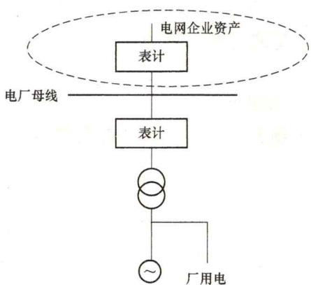
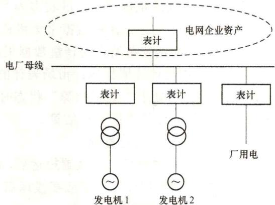
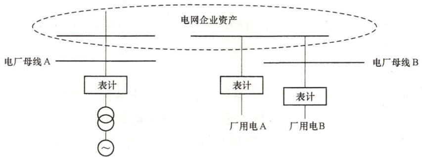

# 99. 什么是电能量计量系统？现货市场建设为何需要完备的电能量计量系统？现货市场建设对电能量计量系统有什么新的技术要求？

（1）电能量计量系统。

电能量计量系统（tele-meter reading system，TMR）主要实现电厂上网、下网和联络线关口点电能量的计量，分时段存储、采集和处理，为结算和分析提供基本数据。

（2）现货市场建设需要完备的电能量计量系统的原因。

现货市场结算需要通过采集市场计量装置的计量数据确定每个参与市场的发电机组的分时电量和用户侧每个计量点的分时电量，需要保证电能量的采集、传送、处理过程的可靠性、唯一性、准确性和连续性。完备的电能量计量系统关系到市场成员的切身利益、是保障准确结算的必要条件，而准确结算也是保障电力市场稳定运营、形成良性循环的基础条件之一，因此现货市场建设需要完备的电能量计量系统。

（3）现货市场建设对电能量计量系统的技术要求。

电力现货市场对数据采集频率、计量数据准确度、计量数据精度、计量装置及通信装置稳定性、计量系统时钟与标准时钟的同步误差控制、分时段累计存储有更高要求，对计量系统丢失数据补全、采集数据格式、采集终端位置等有新的要求。

1）计量装置精度、功能要求。

电力市场计量装置及技术管理应符合DL/T448—2016《电能计量装置技术管理规程》要求。通过升级或更换电能量采集终端、专用变压器采集终端，关口电能表负荷记录间隔时间应支持设置为$15\mathrm{min}$或现货结算时段，计量数据采集机构应测量、记录和读取其负责的每个市场表计、记录每个交易日、每个交易时段的电量数据。计量自动化系统应能够满足数据在现货市场规定时间内，通过远程自动采集读取计量数据，以满足电力现货市场结算要求。

对于新能源机组、电力用户等发/用电力较小的资源，考虑原有计量回路均与保护、测控回路共用电压互感器、电流互感器，其表计倍率往往较大，亟须通过拓展表计采集小数位数解决时段数据计量精度问题。

受用户侧计量精度难以满足实际业务需求、非统调电厂和用户侧分时电量采集完整率不高、数据上传滞后等因素影响，对用户侧结算和不平衡资金计算造成一定困扰。同时计量数据的自动校验、推送频度等方面与现货市场连续运行要求还存在较大差距，需要进一步完善。

辅助服务通过能量管理系统、电力需求侧系统等计量，由调度机构按结算要求统计辅助服务提供和使用情况。

表计应支持自动根据倍率参数调整二次计量值；若表计自身未自动根据倍率参数调整二次计量值，数据采集机构应按照适用的表计倍率参数对读取到的计量数据进行调整。

若远程读取数据失败3次，计量数据采集机构应及时人工采集市场表计数据。

2）计量数据验证要求。

计量数据采集机构应通过以下方法进行计量数据验证：

a. 根据已发布标准对每个交易时段内读取到的计量数据进行验证。

b. 适用于市场表计、市场主体和零售用户的通用验证规则；个别市场表计特定的验证规则；任何可用的计量数据，包括市场主体提交的表计读数进行验证。

c. 若市场表计在市场表计注册表中状态为“离线”，则任何非零的计量数据皆为“验证失败”。

3）关口计量点设置要求。

发电厂商、拥有配电网运营权的售电公司根据市场运行需要，按照《中华人民共和国合同法》《电能计量装置技术管理规程》等国家和行业规程规范要求，向电网企业提出关口计量的设置申请。电网企业根据申请，在产权分界点处设置关口电能计量点，并与其他市场主体在相关合同、协议中明确。火电、水电机组在主变压器高压侧增加设置关口计量点，单机上网电量按主变压器所计电量比例分劈总上网电量计算；风电、光伏电站可延用原关口计量点参与现货交易。参与贸易结算的关口计量点应在相关合同、协议中给予明确。

新增关口计量点时，由发电厂商、拥有配电网运营权的售电公司向电网企业提交相关设计方案，并完成施工，经电网企业验收合格后方可投运。

4）计量装置安装位置要求。

发电单元接入电网的连接点；直接参与市场用户的设备接入电网的连接点；竞争性零售用户接入电网的连接点；$10\mathrm{kV}$及以上电压等级的非竞争性用户的设备接入电网的连接点；不同电压等级或归属不同电网服务机构的电网间的连接点；省间电网的连接点。

5）计量装置可遵守的规定。

若某发电厂商一个发电单元的上网电量可通过其他发电单元的计量表计和出线侧表计的计量值计算出来，且该计算值满足结算要求的准确度和精确度，相关市场主体可提出电量的计算方法并经调度机构批准，那么该发电单元不需安装市场表计。

发电单元的各个组成部分无需单独安装市场表计，只要能获得满足结算准确度和精确度要求的发电单元电量数据即可。在该连接点整合出的计量数据可以由一个或多个市场表计计算得出，相关市场主体应提出该位置电量的计算方法，并经调度机构批准。例如：在同一位置有多台风力发电机组的风力发电厂。

若厂用电和单个发电单元共用同一个连接点，该连接点的结算电量可由一个双向的市场表计计量得出，则无需为该厂用电和发电单元安装独立的市场表计，如图3-2所示。

若厂用电与多个发电单元共用同一个连接点。应明确厂用电的分配方式，发电厂商可要求指定电厂中的某一发电单元来承担厂用电，在每个交易时段，用该发电单元的发电量减掉厂用电得到的净发电量进行结算；发电厂商可要求按照发电单元容量的比例分配厂用电，在每个交易时段，用每个发电单元的发电量减掉分配的厂用电得到的净发电量进行结算，如图3-3所示。

图3-2 厂用电和发电单元安装独立的市场表计图3-3厂用电与多个发电单元共用同一个连接点

若电厂的连接点与发电单元的连接点不同，此类厂用电应视为负荷。发电厂商应将其注册为市场用户或通过零售商购买这部分用电量。负荷单元和市场用户的费用结算要求适用于此类厂用电，如图3-4所示。

图3-4 电厂的连接点与发电单元的连接点不同

6）关口计量点配置要求。

发电厂商，I、Ⅱ类电力用户和Ⅲ类重要电力用户的关口计量点，原则上应安装同型号、同规格、同精度的主副电能表各一套，主副表应有明确标志。以主表计量数据作为结算数据，副表计量数据作为参照。当确认主表故障后，副表计量数据替代主表计量数据作为电量结算数据。其他电力用户关口计量点至少安装一具符合技术要求的电能计量装置。

电能计量装置精度的选择以供电容量及被计量对象的重要程度为基础，按照DL/T448—2016《电能计量装置技术管理规程》要求配置。现场计量装置时钟以北斗或GPS标准时钟为基准，实现自动对时。

7）故障检测与修复要求。

a. 若计量数据采集机构怀疑市场表计故障，则需支持重新读取市场表计每$30\mathrm{min}$的计量数据和底码值；及时通知表计服务机构并提供疑似故障的支持材料。

b. 若收到计量数据采集机构通知或通过例行检查怀疑市场表计出现故障，表计服务机构应：

a）通知表计注册机构该表计的状态为“疑似故障”；立即进行故障诊断；迅速人工读取电表底码值，并发送到计量数据采集机构；立即修复或更换故障表计；更换表计后，应人工读取表计初始值并发送给计量数据采集机构。

b）立即通知表计注册机构：市场表计的管理和技术细节变更。

c. 当市场表计处于“疑似故障”状态时，若该市场表计无副表，计量数据采集机构应对该市场表计的计量数据进行估算。

8）关口计量装置运行管理。

新建、改（扩）建关口计量装置投运后，产权单位应建立相应的运行档案并及时维护。新建、改（扩）建关口计量装置应在投运后1个月内，进行首次现场检验（投运时间以首次抄见电量时间为准）。

现场关口电能计量装置由相关责任部门和人员负责日常维护，保证其封印、接线、外观结构完好，不受人为损坏。发现异常时应及时报送产权单位和运维单位进行消缺处理。

关口计量装置产权单位应定期开展电能计量装置配置情况、修调前检验及监督抽检结果、故障差错情况等统计分析，评价电能计量装置配置水平和运行质量，为制定、实施电能计量装置改造计划提供依据。

市场主体对关口计量装置计量电量有异议时，可向关口计量装置产权单位提出申请，由产权单位组织相关方共同向有资质的计量检定机构提出检验申请。如果检定合格，检定费用由提出单位承担；如果检定存在误差，由产权单位承担检定费用。差错电量按检定结果进行更正。

9）计量数据异常处理。

电能计量装置是电能量计量数据的唯一来源。市场结算用的关口计量数据，原则上应由电能计量采集管理信息系统自动采集。自动采集数据不完整时，由电能计量采集管理系统根据拟合规则补全。当计量装置故障等问题导致计量表计底码值不可用时，计量装置管理机构依据相关规则出具电量更正报告，由交易机构组织相关市场主体确认后进行电量追退补。

10）不具备自动采集条件发电厂商计量数据处理。

对于暂不具备实现自动采集的发电厂商，按照市场规则要求的周期，由该发电厂商提供相应关口计量点的计量数据。各相关发电厂商应设专人负责严格按时抄表，及时报送关口计量数据。相关发电厂商应在不多于一个电费结算周期内完成计量装置的改造，实现计量数据的自动采集。

11）封印管理。

关口计量装置使用的封印样式和编号方式等由电网企业按照省级市场监管机构相关要求订制及管理。

关口点计量装置变更时，在现场工作结束后应对关口计量装置实施封印，记录封印编号，由各方代表在记录中签名确认。

相关各方均应做好关口计量装置封印维护和管理，任何一方不得无故擅自开启封印，确保封印完好。

